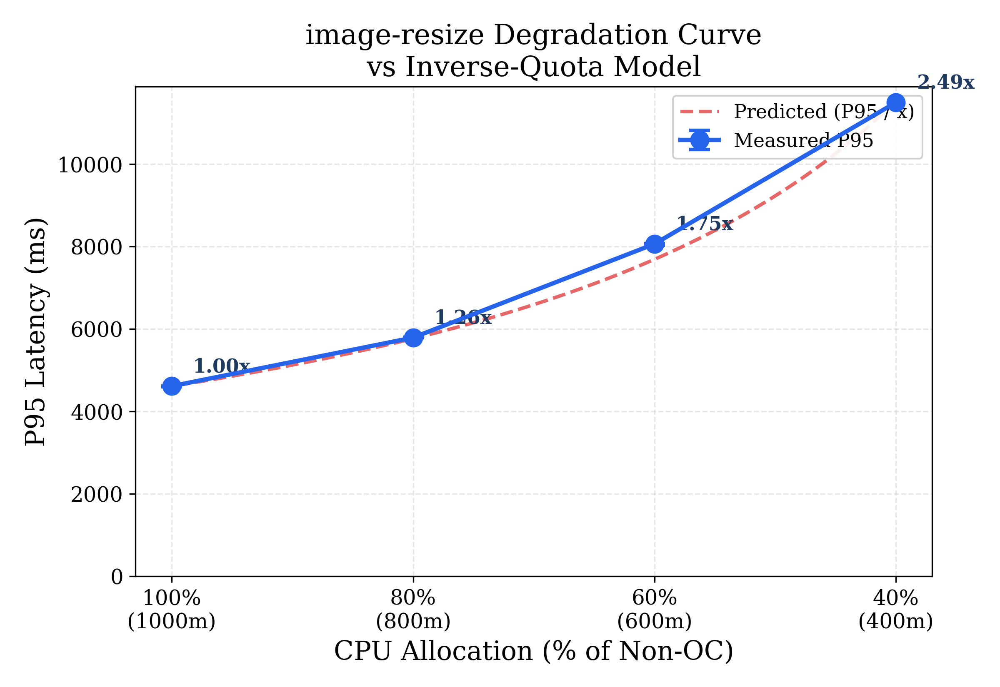
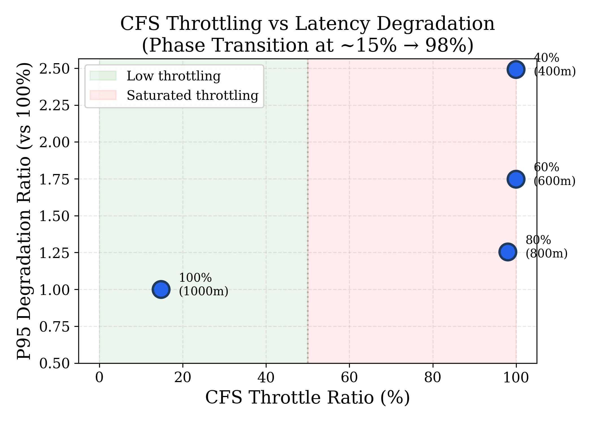
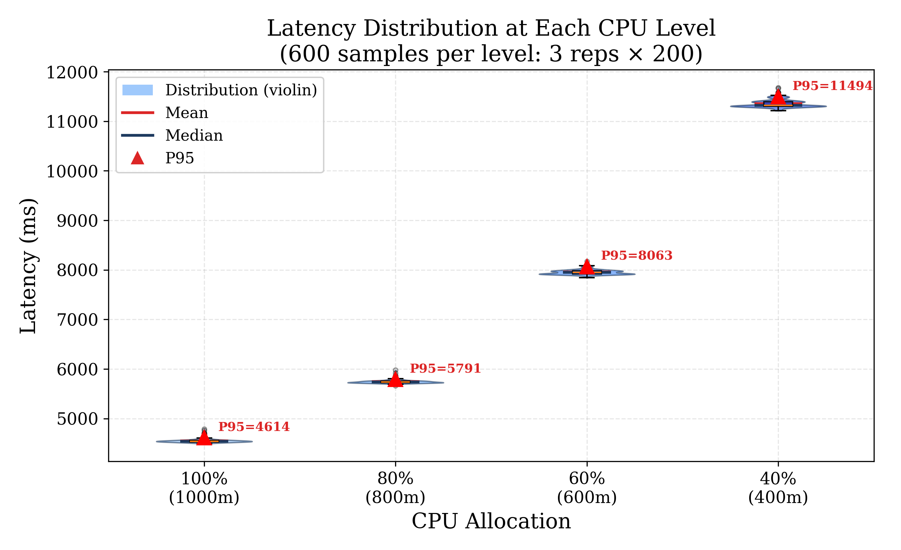
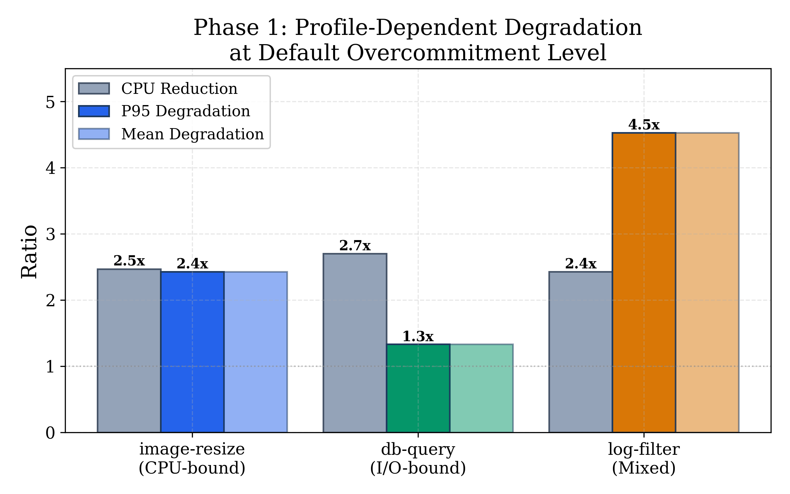
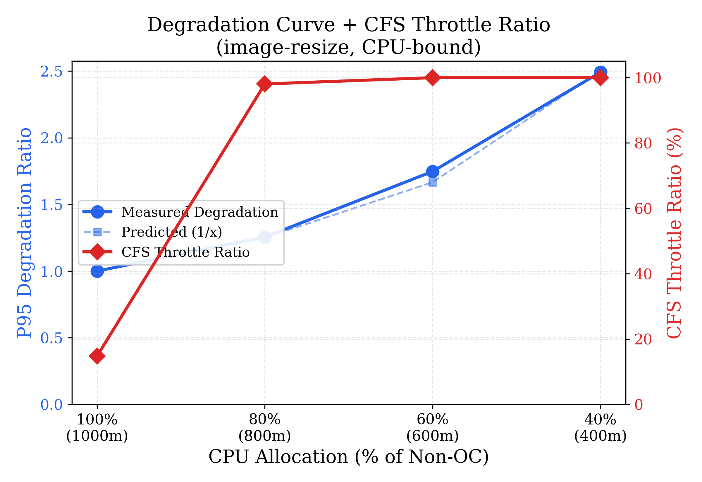
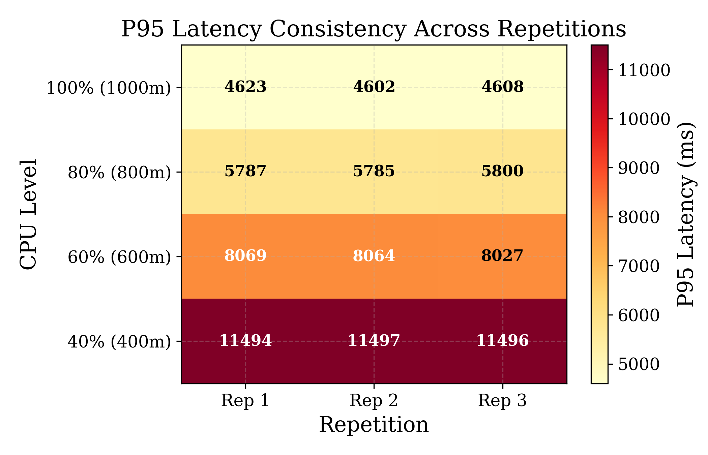

# Characterizing the Impact of Resource Overcommitment on <br/> Serverless Function Latency Across Workload Profiles

<table width="100%" style="border:none; margin-top:4pt; margin-bottom:16pt;">
<tr><td align="center" style="border:none; padding:2pt 0;">
<b><span style="font-size:13pt;">CSL7510 &mdash; Cloud Computing</span></b>
</td></tr>
<tr><td align="center" style="border:none; padding:14pt 0 4pt 0;">
<span style="font-size:11pt;">Anshul Kumar (M25AI2036), Neha Prasad (M25AI2056), Kirtiman Sarangi (G25AI1024)</span>
</td></tr>
<tr><td align="center" style="border:none; padding:10pt 0 2pt 0;">
<b><span style="font-size:11pt;">M.Tech Artificial Intelligence</span></b>
</td></tr>
<tr><td align="center" style="border:none; padding:2pt 0;">
<b><span style="font-size:11pt;">Indian Institute of Technology Jodhpur</span></b>
</td></tr>
<tr><td align="center" style="border:none; padding:8pt 0 0 0;">
<span style="font-size:10pt; color:#555;">April 2026</span>
</td></tr>
</table>

---

## Abstract

Serverless computing platforms waste up to 75% of reserved resources because users overestimate their functions' needs. Resource overcommitment -- allocating less physical capacity than the sum of reservations -- is the natural fix, but blind overcommitment causes P95 latency increases of up to 183%. The Golgi system (Li et al., SoCC 2023, Best Paper) proposes profile-aware scheduling built on the hypothesis that CPU-bound, I/O-bound, and mixed functions respond differently to overcommitment, but this foundational assumption is not independently validated in their work. We provide that characterization. Through controlled experiments on a 5-node AWS cluster running k3s and OpenFaaS, we deploy three benchmark functions (one per profile) and measure latency degradation across 3,600 total requests. Phase 1 establishes the cross-profile contrast at one overcommitment level: CPU-bound functions degrade proportionally to CPU reduction (2.43x for a 2.47x CPU cut), I/O-bound functions are resilient (1.33x for a 2.70x cut), and mixed functions suffer disproportionately (4.53x for a 2.43x cut). Direct cgroup v2 CPU burst measurement reveals the mechanism: mixed-function requests consume 7.7 ms of CPU each, and when the CFS quota boundary falls near this burst size, requests deterministically split into a fast mode (~16 ms) and a slow mode (~80-100 ms). Phase 2 maps the degradation curve for the CPU-bound function (image-resize) across four CPU levels (100%, 80%, 60%, 40%), confirming near-perfect inverse-quota scaling (R-squared = 0.9949) with a CFS throttle ratio phase transition from 14.8% to 98%+. These results validate the foundational hypothesis underlying profile-aware serverless scheduling and provide actionable characterization data for overcommitment policy design.

---

## Table of Contents

1. [Introduction](#1-introduction)
2. [Background and Related Work](#2-background-and-related-work)
3. [Experimental Design](#3-experimental-design)
4. [Implementation](#4-implementation)
5. [Baseline Characterization](#5-baseline-characterization)
6. [Results and Analysis](#6-results-and-analysis)
7. [Discussion](#7-discussion)
8. [Conclusion](#8-conclusion)
9. [References](#9-references)

---

## 1. Introduction

### 1.1 The Serverless Resource Problem

Serverless computing, often called Function-as-a-Service (FaaS), lets developers deploy individual functions without managing servers. The cloud provider handles scaling, container lifecycle, and infrastructure. Users write a function, push it, and pay per invocation. AWS Lambda, Azure Functions, and Google Cloud Functions process millions of invocations per day on this model.

The pricing and scheduling model works like this: a user declares how much memory their function needs (say, 512 MB), and the platform allocates CPU proportionally. The platform then reserves those resources on a physical machine for the lifetime of each invocation. This reservation is a guarantee. If the user asks for 512 MB, the platform sets a hard cgroup limit at 512 MB, and no other container can touch that memory.

The problem is that users are terrible at estimating what they actually need. Shahrad et al. [2] analyzed production traces from Azure Functions and found that functions use roughly 25% of their reserved resources on average. The median memory consumption was 29 MB for functions configured with 512 MB or more. Three-quarters of all reserved resources sit idle.

This waste compounds at scale. A cloud provider running a million concurrent function instances, with each instance holding resources it will never touch, is leaving enormous capacity on the table. Users, meanwhile, pay for memory they never use. The fundamental tension is between safety (guaranteeing reserved resources so functions never get starved) and efficiency (not wasting 75% of a data center's capacity on empty reservations).

### 1.2 Why Overcommitment Alone Fails

The obvious fix is overcommitment: allocate less physical memory and CPU than the sum of all reservations, and bet that not everyone will spike at once. This is standard practice in virtualization. VMware ESXi routinely overcommits memory by 2-4x using techniques like ballooning, transparent page sharing, and swap. It works because VM workloads are relatively stable and long-lived, giving the hypervisor time to react when pressure rises.

Serverless functions are a different beast. They are short-lived (milliseconds to seconds), bursty (a function might go from zero to a thousand concurrent invocations in seconds), and densely co-located (dozens of different functions from different users share the same physical host). When a provider blindly squeezes resource allocations across the board, multiple co-located functions can spike simultaneously. They compete for shared CPU cycles, memory bandwidth, and last-level cache. The result is contention, and contention means latency.

Li et al. [1] measured this directly. Blind overcommitment on their test cluster caused P95 latency to increase by up to 183%. For a function serving an API endpoint with a 200 ms SLO, that kind of degradation is a contract violation. Users choose serverless precisely because they do not want to think about infrastructure. If the platform silently makes their functions 2.8x slower during peak load, the abstraction has broken its promise.

The challenge, then, is not whether to overcommit, but how to overcommit intelligently. Understanding which functions tolerate reduced resources and which do not is a prerequisite for any safe overcommitment strategy.

### 1.3 The Golgi Hypothesis

Golgi, proposed by Li et al. [1] at ACM SoCC 2023 (where it won the Best Paper award), addresses this challenge with an ML-guided routing system. The full system includes a two-instance model (Non-OC and OC variants of each function), a Mondrian Forest classifier that predicts SLO violations from real-time cgroup metrics, a request router that directs traffic to OC or Non-OC instances based on predictions, and an AIMD vertical scaler that adjusts concurrency limits. On seven c5.9xlarge workers running eight benchmark functions under Azure Function trace replay, Golgi achieved 42% memory cost reduction while keeping SLO violations below 5%.

But the Golgi system is built on a foundational hypothesis that is assumed rather than independently validated:

> **Different function workload profiles respond differently to resource overcommitment. CPU-bound functions degrade proportionally to CPU reduction, I/O-bound functions are resilient, and mixed functions exhibit non-linear degradation from Linux CFS scheduler interactions.**

The Golgi paper's evaluation focuses on end-to-end system metrics -- cost reduction percentages and SLO violation rates. These results demonstrate that the full system works, but they do not isolate and characterize the underlying profile-dependent degradation behavior that the system relies upon. The hypothesis is the foundation on which the ML classifier, the routing logic, and the two-instance architecture all rest. If the hypothesis is wrong -- if all profiles degrade similarly, or if the degradation is not predictable -- the entire Golgi architecture loses its rationale.

### 1.4 Motivation for This Study

We characterize how Linux CFS quota enforcement creates profile-dependent latency degradation under container resource overcommitment -- the phenomenon that motivates profile-aware scheduling systems like Golgi. Rather than rebuilding the Golgi system, we design controlled experiments that isolate overcommitment's effect on latency across three workload profiles: CPU-bound, I/O-bound, and mixed.

Our approach goes beyond the single-point OC-vs-Non-OC comparison implicit in the Golgi paper. Phase 1 establishes the cross-profile contrast at one overcommitment level, confirming that degradation is profile-dependent. Phase 2 then performs a deep multi-level characterization of the CPU-bound function across four CPU levels (100%, 80%, 60%, 40%) to map the degradation curve shape and validate the CFS throttling mechanism quantitatively. We focus on the CPU-bound function because it provides the cleanest experimental isolation: its latency is dominated entirely by CPU cycles, so CFS quota enforcement is the sole degradation mechanism, free of I/O confounds.

We are motivated by two observations.

First, degradation curves are more useful than point comparisons. Knowing that a CPU-bound function is 2.4x slower at one specific overcommitment level tells an operator very little. Knowing that degradation follows the inverse of the CPU fraction with R-squared > 0.99 gives an operator a predictive model for setting overcommitment policies.

Second, the CFS mechanism that the paper invokes for mixed-function degradation is testable. The Linux CFS bandwidth controller enforces CPU limits via a quota-and-period mechanism. When a container's CPU burst size sits near the quota boundary, some bursts complete within a single period while others spill into the next period and incur a full-period throttling penalty. This creates bimodal latency. We validate this explanation experimentally by measuring the per-request CPU burst size via cgroup v2 counters and showing that the burst-to-quota ratio predicts the observed bimodal latency distribution.

### 1.5 Research Questions and Contributions

We address two research questions through controlled experiments on real AWS infrastructure:

**Table 1: Research questions and corresponding experiments.**

| # | Research Question | Experiment |
|---|---|---|
| RQ1 | How does P95 latency degrade as CPU allocation decreases for a CPU-bound serverless function, and does CFS throttling explain the degradation? | Phase 1 cross-profile baseline + Phase 2 multi-level degradation curve (4 levels) |
| RQ2 | Can the bimodal latency behavior of mixed functions under overcommitment be explained by CFS quota boundary effects? | Baseline bimodality observation + cgroup v2 CPU burst measurement |

Our contributions are:

1. **Degradation curve** showing the relationship between CPU allocation and P95 latency for a CPU-bound function across four overcommitment levels on real infrastructure, with CFS throttle ratio correlation at each level (R-squared = 0.9949 for inverse-quota model fit).
2. **Cross-profile comparison** at a single overcommitment level demonstrating that degradation is profile-dependent: proportional for CPU-bound (2.43x), minimal for I/O-bound (1.33x), and disproportionate for mixed (4.53x).
3. **Mechanistic explanation** of bimodal CFS throttling behavior in mixed workloads, validated experimentally through direct cgroup v2 CPU burst measurement and throttle ratio analysis.
4. **Empirical characterization** of the profile-dependent degradation phenomenon -- the foundational observation that motivates profile-aware scheduling systems like Golgi -- grounded in direct measurement rather than system-level end-to-end metrics.

### 1.6 Report Organization

Section 2 covers background on serverless computing, resource overcommitment in cloud systems, the Linux CFS scheduler, and the Golgi paper's design. Section 3 describes our experimental design: the two-instance model, benchmark functions, overcommitment calculations, and the two experiments we run. Section 4 covers implementation specifics: AWS infrastructure, k3s cluster setup, OpenFaaS deployment, and benchmark function construction. Section 5 presents baseline characterization results, including the CFS burst measurement that answers RQ2, establishing SLO thresholds and validating the experimental setup. Section 6 presents the multi-level degradation curve results that answer RQ1. Section 7 discusses findings, limitations, threats to validity, and future work. Section 8 concludes.

---

## 2. Background and Related Work

### 2.1 Serverless Computing Model

Serverless computing abstracts away infrastructure entirely. A developer writes a stateless function, deploys it to a platform (AWS Lambda, Azure Functions, Google Cloud Functions, or a self-hosted system like OpenFaaS), and the platform takes care of everything else: provisioning containers, scaling replicas up and down, routing requests, and recycling idle instances. Functions are triggered by events, typically HTTP requests, message queue entries, or timers.

The execution lifecycle of a single invocation follows a predictable pattern. If no warm container exists for the function, the platform performs a cold start: it pulls the container image, creates a new container, initializes the runtime, and loads the function code. This takes anywhere from tens of milliseconds (for lightweight Go binaries) to several seconds (for Python functions with large dependency trees). Once the container is warm, subsequent requests reuse it, skipping the cold start. After a period of inactivity, the platform evicts the container to free resources.

Billing follows two dimensions: a flat per-invocation fee and a per-GB-second charge based on the memory the user configures. On AWS Lambda, for example, a user selects a memory size between 128 MB and 10,240 MB, and the platform allocates CPU proportionally. A function configured with 1,769 MB gets one full vCPU; half the memory gets half the CPU. The user pays for this configured memory for the entire duration of each invocation, regardless of how much memory the function actually touches.

This billing model creates a perverse incentive. Users configure conservatively, choosing higher memory to avoid out-of-memory kills, but then use only a fraction of what they reserve. The platform, bound to honor those reservations, cannot schedule other work into the unused capacity. The result, quantified by Shahrad et al. [2] in their analysis of Azure Functions production traces, is that functions consume roughly 25% of their reserved resources on average. The remaining 75% is effectively stranded.

### 2.2 Resource Overcommitment in Cloud Systems

Overcommitment addresses this waste by allocating less physical capacity than the sum of all reservations, gambling that not all tenants will peak at the same time. The technique is well-established in virtualization. VMware ESXi routinely overcommits memory by 1.5-4x using a combination of ballooning (a guest-level driver that reclaims unused pages), transparent page sharing (deduplicating identical memory pages across VMs), and swap (spilling excess to disk). KVM-based hypervisors use similar mechanisms. These techniques work because VM workloads are long-lived and change slowly enough for the hypervisor to adjust.

In Kubernetes, the distinction between resource requests and limits serves a similar purpose. A container's resource request is a guaranteed minimum that the scheduler uses for bin-packing decisions. Its limit is a ceiling enforced by the kernel's cgroup controller. Setting limits higher than requests allows the container to burst into unused capacity on the node. The ratio between the sum of all limits and the node's physical capacity determines the overcommitment factor.

Serverless functions make overcommitment harder for several reasons. Functions are short-lived, often completing in tens of milliseconds, which means the system has no time to react to individual resource spikes using ballooning or similar feedback mechanisms. Workloads are bursty and unpredictable: a function might receive zero invocations for minutes, then thousands in a second. Cold starts add a latency penalty that compounds under resource pressure, because spinning up a new container itself requires CPU and memory. And dense co-location means dozens of different functions from different users share the same physical host, increasing the probability that multiple functions spike simultaneously.

Shahrad et al. [2] showed that despite these challenges, Azure Function traces exhibit temporal patterns (diurnal cycles, periodic triggers, correlated bursts) that are in principle predictable. This observation opened the door for prediction-based overcommitment: instead of statically squeezing all allocations, use runtime signals to decide when overcommitment is safe and when it is not.

### 2.3 Existing Scheduling Approaches

Traditional load balancing strategies operate without awareness of resource state. Round-robin distributes requests evenly across instances regardless of how loaded each one is, which works well when all instances are identical and equally busy, but fails when workloads are heterogeneous or when some instances are under contention. Least-connections improves on this by tracking active request counts, but still has no visibility into CPU utilization, memory pressure, or cache interference on the underlying host.

The Kubernetes default scheduler takes a bin-packing approach based on declared resource requests. When a new pod needs to be placed, the scheduler scores candidate nodes by how well the pod's resource requests fit into the node's remaining allocable capacity. This is a static, placement-time decision. Once a pod is running, the scheduler does not move it or adapt to runtime contention. If five functions happen to spike on the same node, the scheduler is unaware.

Several research systems have addressed parts of this problem. Harvest VMs (Ambati et al. [3]) let low-priority workloads consume spare capacity on partially-utilized servers, but offer no latency guarantees when the primary workload reclaims its resources. Kraken (Wen et al. [4]) focuses on cold-start-aware container provisioning for DAG-structured serverless workflows. It reduces end-to-end latency by pre-warming containers along the critical path, but does not address the resource overcommitment problem. ENSURE (Suresh et al. [5]) provides SLO-aware scheduling for serverless functions, but operates reactively: it detects violations after they happen and adjusts resource allocations in response, rather than predicting and preventing them.

The gap in the literature is a system that combines proactive prediction of resource contention, routing decisions that exploit the difference between overcommitted and fully-provisioned instances, and an adaptive feedback mechanism. Golgi fills this gap with a complete system. But underneath every contention-aware scheduling system lies an assumption: that contention's effect on latency is predictable and varies by workload profile. This assumption has not been independently characterized. Our work provides that characterization.

### 2.4 The Golgi Paper in Detail

The Golgi system, proposed by Li et al. [1], sits between the serverless platform's API gateway and the function instances. For each deployed function, Golgi maintains two sets of container replicas: Non-OC instances provisioned at the user's declared resource levels, and OC instances provisioned at reduced levels computed from observed actual usage. The overcommitment formula is `OC_allocation = 0.3 * claimed + 0.7 * actual`, weighting 70% toward measured usage with a 30% safety margin from the original reservation.

A metric collection daemon running on each worker node scrapes nine metrics from every function container at 500 ms intervals: CPU utilization, memory utilization, memory bandwidth, network bytes sent, network bytes received, disk I/O read, disk I/O write, the count of inflight requests, and the LLC (last-level cache) miss rate. These metrics are read from the Linux cgroup filesystem and hardware performance counters, then forwarded to a central ML module.

The ML module trains a Mondrian Forest classifier [6], an online variant of Random Forests that can incorporate new training samples incrementally without full retraining. Each training sample is a feature vector of the nine metrics paired with a binary label: 1 if the corresponding request's latency exceeded the SLO threshold (defined as the P95 latency of the Non-OC baseline), 0 otherwise. A critical implementation detail is the use of stratified reservoir sampling to maintain a balanced training set. Without this balancing step, the training data would be heavily skewed toward negative samples (most requests meet the SLO), and the classifier's F1 score would drop from 0.78 to 0.26.

The router uses a Power of Two Choices algorithm for instance selection. For each incoming request, it samples two OC instances, queries the classifier for each one's current violation probability, and routes the request to the instance with the lower probability. If both probabilities exceed a safety threshold, the request goes to a Non-OC instance instead. A global Safe flag, computed from the rolling P95 latency across all OC instances, provides a coarse-grained override: when contention is system-wide, the flag flips to unsafe and all requests are routed to Non-OC instances until conditions improve.

Vertical scaling provides a second layer of defense. An AIMD controller on each OC instance monitors its SLO violation rate over a rolling window. If the violation rate exceeds 5%, the controller decreases the instance's maximum concurrency by one (multiplicative decrease, floored at 1). If violations stay below 2% for three consecutive windows, it increases concurrency by one (additive increase). Reducing concurrency means fewer concurrent requests per container, less contention for CPU and cache, and lower tail latency, at the cost of needing more containers or longer queue wait times.

The original evaluation used eight benchmark functions spanning five languages, deployed on seven c5.9xlarge workers (36 vCPUs, 72 GB RAM each), driven by replayed Azure Function Trace workloads. Golgi achieved 42% memory cost reduction, 35% VM time reduction, and kept SLO violations below 5%.

### 2.5 Relationship Between Our Study and the Golgi System

Table 2 clarifies the relationship between our empirical study and the Golgi system. Our work is not a replication of Golgi. We do not build an ML classifier, a request router, or a vertical scaler. Instead, we characterize the profile-dependent degradation phenomenon that the Golgi system is built upon.

**Table 2: Scope comparison between the Golgi system and our empirical study.**

| Dimension | Golgi (Li et al.) | Our Study |
|---|---|---|
| **Goal** | Build an ML-guided overcommitment routing system | Characterize profile-dependent degradation under overcommitment |
| **Approach** | End-to-end system (classifier + router + scaler) | Controlled experiments isolating overcommitment effects |
| **What is measured** | Cost reduction, SLO violation rate (system metrics) | Degradation curves, CFS throttling behavior (characterization data) |
| **Cluster** | 7x c5.9xlarge (36 vCPU, 72 GB each) | 3x t3.xlarge (4 vCPU, 16 GB each) |
| **Functions** | 8 functions in 5 languages | 3 functions in Python/Go (one per profile) |
| **Overcommitment levels** | One OC level per function (formula-derived) | Phase 1: one OC level (cross-profile); Phase 2: four levels (CPU-bound deep dive) |
| **CFS analysis** | Mentioned as explanation for mixed-function behavior | Experimentally characterized via cgroup v2 burst measurement |
| **ML/Routing** | Core contribution (Mondrian Forest + Power-of-Two router) | Not in scope -- we characterize the phenomenon that motivates these components |

The Golgi paper assumes that overcommitment impact is profile-dependent and uses that assumption to justify building a complex scheduling system. We characterize whether this profile-dependent degradation exists, how it manifests across overcommitment levels, and what mechanism drives it. This characterization is valuable regardless of whether it aligns with or complicates the Golgi paper's assumptions -- either outcome informs the design of overcommitment-aware schedulers.

---

## 3. Experimental Design

This section describes the design of our empirical study: the two-instance model we adopt from the Golgi paper, the benchmark functions that cover three workload profiles, the overcommitment calculations, and the two experiments we run to characterize degradation behavior. Implementation details (infrastructure, deployment, tooling) follow in Section 4.

### 3.1 Overview

Our study design has two phases of experimentation. Phase 1 establishes the cross-profile baseline: we deploy all three benchmark functions in both Non-OC and OC configurations and measure latency at a single overcommitment level. This confirms whether profiles respond differently and reveals the CFS mechanism through direct burst measurement. Phase 2 performs a deep characterization of the CPU-bound function (image-resize) across four CPU levels, producing a degradation curve that validates the inverse-quota model and quantifies the CFS throttle ratio at each level.

```
                         +-----------------+
                         | Load Generator  |
                         | (bash/curl)     |
                         +-------+---------+
                                 |
                                 | HTTP (sequential)
                                 v
                         +-----------------+
                         | OpenFaaS Gateway|
                         | (port 31112)    |
                         +--+-----------+--+
                            |           |
                   Non-OC   |           |   OC
                            v           v
                      +-----------+ +-----------+
                      | Function  | | Function  |
                      | (full CPU | | (reduced  |
                      |  & memory)| |  CPU/mem) |
                      +-----------+ +-----------+
                            |           |
                            v           v
                      [Latency recorded per request]
                      [cgroup metrics: cpu.stat, memory.current]
```

The key design principle is isolation. Each experiment varies one factor at a time. Phase 1 holds concurrency at 1 and compares Non-OC vs OC at a single overcommitment level, while also measuring the CFS burst size that explains the observed bimodal behavior. Phase 2 varies CPU allocation across four levels while holding concurrency at 1 and focusing on a single function. This structure lets us attribute latency changes to specific causes.

### 3.2 Two-Instance Model

Following the Golgi paper's methodology, we deploy each function in two variants: Non-OC (non-overcommitted) with the user's declared resource allocation, and OC (overcommitted) with reduced resources computed from observed actual usage. The overcommitment formula from the paper is:

```
OC_allocation = alpha x claimed + (1 - alpha) x actual
```

The paper uses alpha = 0.3, giving 70% weight to measured usage and retaining 30% of the original reservation as a safety margin. We adopt the same value to ensure our OC configurations are directly comparable to those the Golgi system would create.

To measure actual usage, we deploy each function in its Non-OC configuration, send 100 requests under no concurrent load, and record the P75 of memory consumption from the cgroup's `memory.current` file. CPU actual usage is derived similarly from `cpu.stat`. Applying the formula yields the OC resource allocations shown in Table 3.

**Table 3: Resource configurations for Non-OC and OC function variants.**

| Function | Profile | Non-OC CPU | OC CPU | CPU Reduction | Non-OC Memory | OC Memory | Memory Reduction |
|---|---|---|---|---|---|---|---|
| image-resize | CPU-bound | 1000m | 405m | 2.47x | 512 Mi | 210 Mi | 59% |
| db-query | I/O-bound | 500m | 185m | 2.70x | 256 Mi | 105 Mi | 59% |
| log-filter | Mixed | 500m | 206m | 2.43x | 256 Mi | 98 Mi | 62% |

Both variants run from the same container image. The only difference is the Kubernetes resource requests and limits specified in the deployment manifest. The OC variant's container has less CPU time available (the kernel's CFS scheduler enforces the CPU limit via cgroup `cpu.max`) and a lower memory ceiling (the kernel's OOM killer fires if `memory.current` exceeds `memory.max`). Under light load, the OC instance may perform comparably to Non-OC because the function's actual resource consumption falls within the reduced allocation. Under heavier load or with bursty CPU work, the OC instance hits its limits, and the degree of degradation depends on the function's workload profile, which is precisely what we measure.

### 3.3 Benchmark Functions

We deploy three benchmark functions, one for each major workload profile identified in the Golgi paper. Three functions are the minimum needed to test the hypothesis that profiles respond differently to overcommitment. Each function is designed so that its dominant resource bottleneck is clear and controllable.

**image-resize (CPU-bound, Python).** Generates a random RGB image (1920x1080 pixels), then downscales it to half size (960x540) using Pillow's Lanczos resampling filter. Lanczos resampling applies a windowed sinc convolution kernel per output pixel, making the computation directly proportional to available CPU cycles. Memory usage is modest and predictable (two image buffers of known size). This function's latency should scale proportionally with CPU reduction, since CPU is the sole bottleneck.

**db-query (I/O-bound, Python).** Connects to a Redis instance running within the cluster and performs a GET -> SET -> GET sequence. Latency is dominated by network round-trips between the function container and the Redis pod, not by CPU computation. Even with significantly reduced CPU, the function should perform similarly because it spends most of its execution time waiting on network I/O. This function tests the hypothesis that I/O-bound functions are resilient to overcommitment.

**log-filter (Mixed, Go).** Generates 1000 synthetic log lines, applies regex matching to filter lines containing `ERROR`, `WARN`, or `CRITICAL`, and runs IP address anonymization via regex replacement. This exercises both CPU (regex compilation and matching, string operations) and memory (string allocation, buffer management). Critically, the function's CPU burst size sits near the CFS quota boundary under overcommitment. Some invocations complete within a single CFS period; others spill into the next period and incur a full-period throttling penalty. This creates the bimodal latency distribution that the Golgi paper attributes to CFS interactions. Written in Go to demonstrate language diversity and to ensure the mixed behavior comes from the workload characteristics, not from Python interpreter overhead.

### 3.4 Experiment Design

**Experiment 1 (Phase 1): Cross-Profile Baseline and CFS Mechanism (RQ1 + RQ2).** We deploy all three functions in both Non-OC and OC variants (six deployments total) and send 200 sequential requests to each. This establishes the cross-profile contrast at a single overcommitment level and reveals bimodal latency in the mixed function. We then perform direct cgroup v2 `cpu.stat` measurement to determine the per-request CPU burst size, quantifying the CFS mechanism behind the bimodality. Total measurement: 6 variants x 200 requests = 1,200 requests.

**Experiment 2 (Phase 2): Multi-Level Degradation Curve (RQ1).** We deploy image-resize at four CPU levels (100%, 80%, 60%, 40% of the Non-OC value). Memory is held at the Non-OC level (512 Mi) for all variants to isolate the effect of CPU reduction from memory pressure. We send 200 sequential requests to each variant, repeated 3 times, and record per-request latency and CFS throttling counters from cgroup `cpu.stat` before and after each level. We focus on image-resize because it provides the cleanest experimental isolation: its latency is dominated entirely by CPU cycles, so CFS quota enforcement is the sole degradation mechanism. The range 100% to 40% captures the practical operating range; below 40%, a 2.5x slowdown makes most real functions SLO-violating, so operators rarely overcommit that aggressively. Total measurement: 4 levels x 200 requests x 3 repetitions = 2,400 requests.

**Combined total: 3,600 latency measurements + 8 cgroup snapshots.**

---

## 4. Implementation

### 4.1 Infrastructure Setup

All resources run on AWS in `us-east-1a` inside a dedicated VPC (`10.0.0.0/16`) with a single subnet (`10.0.1.0/24`). The cluster consists of five EC2 instances:

**Table 4: Cluster nodes and their roles.**

| Node | Instance Type | vCPU | RAM | Role |
|---|---|---|---|---|
| golgi-master | t3.medium | 2 | 4 GB | k3s server, OpenFaaS gateway |
| golgi-worker-1 | t3.xlarge | 4 | 16 GB | Function containers, cgroup measurement |
| golgi-worker-2 | t3.xlarge | 4 | 16 GB | Function containers, cgroup measurement |
| golgi-worker-3 | t3.xlarge | 4 | 16 GB | Function containers, cgroup measurement |
| golgi-loadgen | t3.medium | 2 | 4 GB | Request generation, latency measurement |

We chose t3.xlarge workers (4 vCPU, 16 GB RAM, $0.1664/hr) because four vCPUs provide enough headroom to observe CPU contention when multiple containers compete for CPU time, and 16 GB accommodates 6+ function containers per worker with room for k3s overhead. The paper used c5.9xlarge instances (36 vCPU, 72 GB, $1.53/hr) -- our instances are 10x cheaper while still demonstrating the same CFS and cgroup behaviors at a smaller scale. The total cluster cost is approximately $0.58/hr ($14/day). The infrastructure ran for five days (April 11--16, 2026), totaling approximately $70 in AWS costs.

The Kubernetes layer uses k3s v1.34.6, a lightweight Kubernetes distribution that provides the same API, scheduling, and cgroup enforcement as full Kubernetes but deploys as a single binary with embedded etcd. We chose k3s over kubeadm for faster setup and lower memory overhead -- the k3s server uses approximately 500 MB RAM at our scale. We disabled the bundled Traefik ingress controller since we invoke functions directly through the OpenFaaS gateway.

OpenFaaS was deployed via Helm into the `openfaas` namespace, running five components: the HTTP gateway (exposed as NodePort 31112), Prometheus for metrics, NATS for async messaging, AlertManager, and a queue worker. Function invocations go through the gateway at `http://<master-ip>:31112/function/<name>`.

The security group allows SSH from our IP, all intra-VPC traffic (for k3s control plane and pod networking), and the OpenFaaS NodePort range from our IP. All instances run Amazon Linux 2023 (kernel 6.1.166) with cgroup v2 in unified hierarchy mode -- the modern cgroup interface that exposes CPU, memory, and I/O metrics through a clean filesystem at `/sys/fs/cgroup/`.

### 4.2 Benchmark Functions

Each function is deployed as an OpenFaaS function with two Kubernetes deployment variants: Non-OC (full resources) and OC (overcommitted resources). Both variants use the same container image; only the resource requests and limits in the deployment manifest differ.

**image-resize (CPU-bound, Python 3.9).** The handler generates a random RGB image of 1920x1080 pixels by iterating over every pixel and assigning random RGB values using Python's `random` module, then downscales it to 960x540 using Pillow's Lanczos resampling filter. The pixel-by-pixel generation in Python's interpreted loop plus the Lanczos windowed sinc convolution make execution time directly proportional to available CPU cycles. Dependencies: `pillow`. Non-OC allocation: 1000m CPU, 512 Mi memory. OC allocation: 405m CPU, 210 Mi memory (2.47x CPU reduction).

**db-query (I/O-bound, Python 3.9).** The handler connects to a Redis instance (deployed as a single pod in the `openfaas-fn` namespace with 64 Mi request / 128 Mi limit) and performs a GET -> SET -> GET sequence using the `redis` Python client. Latency is dominated by three network round-trips between the function container and the Redis pod. CPU consumption is minimal -- the function spends most of its time waiting on I/O. Non-OC allocation: 500m CPU, 256 Mi memory. OC allocation: 185m CPU, 105 Mi memory (2.70x CPU reduction).

**log-filter (Mixed, Go).** The handler generates 1000 synthetic log lines with randomized timestamps, log levels, and source IPs, then applies regex matching to filter lines containing `ERROR`, `WARN`, or `CRITICAL`, and runs IP anonymization via regex replacement. This exercises CPU (regex compilation and matching, string operations) and memory (string allocation, buffer management). Written in Go to ensure the mixed behavior comes from workload characteristics rather than Python interpreter overhead. Non-OC allocation: 500m CPU, 256 Mi memory. OC allocation: 206m CPU, 98 Mi memory (2.43x CPU reduction).

All six function variants (3 functions x 2 resource levels) are defined in a single Kubernetes manifest (`functions/functions-deploy.yaml`) and deployed simultaneously. OpenFaaS auto-scaling is disabled (`com.openfaas.scale.min=1`, `com.openfaas.scale.max=1`) to fix replica counts at 1 per variant, ensuring each measurement targets a single container with a known resource allocation.

For Phase 2, a parameterized deployment template (`functions/phase2-deploy-template.yaml`) uses `envsubst` to inject target CPU and memory values. Each CPU level is deployed, warmed up, measured (3 reps of 200 requests), captured (CFS before and after), and torn down before the next level begins.

### 4.3 Latency Measurement

Latency is measured end-to-end at the load generator using `curl` with nanosecond-precision wall-clock timing (`date +%s%N`). The benchmark script (`scripts/benchmark-latency.sh`) sends sequential HTTP POST requests to each function via the OpenFaaS gateway and records the total round-trip time per request in milliseconds. For each function variant, the script sends 200 requests after a warm-up phase (10 requests discarded) and writes per-request latencies to a raw data file.

Statistical analysis is performed by `scripts/compute-stats.py`, which reads the raw latency files and computes P50, P95, P99, mean, and standard deviation. Plots are generated by `scripts/generate-phase1-plots.py` and `scripts/generate-phase2-plots.py` using matplotlib and numpy at 300 DPI.

### 4.4 cgroup v2 and CFS Configuration

Resource limits are enforced by the Linux kernel's cgroup v2 controllers, configured automatically by k3s based on the Kubernetes resource specifications in our deployment manifests.

**CPU limits** are enforced via the CFS bandwidth controller. A Kubernetes CPU limit of 405m (millicores) translates to a cgroup `cpu.max` value of `40500 100000`, meaning the container gets 40,500 microseconds of CPU time per 100,000 microsecond (100 ms) CFS period. When the container exhausts its quota within a period, all its threads are throttled until the next period begins. This throttling mechanism is the primary driver of latency degradation under overcommitment: a function that completes in one CFS period at full CPU may require two or more periods at reduced CPU, with each period boundary adding up to 100 ms of dead time.

**Memory limits** are enforced via the cgroup memory controller. A Kubernetes memory limit of 210 Mi sets `memory.max` to 220200960 bytes. If the container's resident memory (`memory.current`) exceeds this, the kernel's OOM killer terminates the container process.

**CFS throttling metrics** are read from `cpu.stat` for mechanistic analysis:
- `usage_usec`: cumulative CPU time consumed (microseconds)
- `nr_periods`: total CFS periods elapsed
- `nr_throttled`: periods in which the container exhausted its quota and was throttled
- `throttled_usec`: total time spent in throttled state

By reading these counters before and after a batch of requests, we compute per-request CPU consumption, throttle ratio (`nr_throttled / nr_periods`), and average throttle duration. These metrics directly quantify the CFS mechanism behind overcommitment-induced degradation.

---

## 5. Baseline Characterization

Before running the multi-level degradation experiment, we establish baseline latency profiles for all six function variants (3 functions x {Non-OC, OC}). This baseline serves three purposes: it defines the SLO thresholds used throughout the study, it provides the first evidence for whether the Golgi hypothesis holds at a single overcommitment level, and through the CFS burst measurement, it directly answers RQ2 by quantifying the mechanism behind mixed-function bimodal degradation.

### 5.1 Hardware and Software Configuration

**Table 5: Software stack versions.**

| Component | Version | Notes |
|---|---|---|
| OS | Amazon Linux 2023 | Kernel 6.1.166 |
| k3s | v1.34.6+k3s1 | Containerd 2.2.2 |
| OpenFaaS | Helm revision 1 | Gateway on NodePort 31112 |
| Python | 3.9.25 | On all nodes |
| Go | (built into log-filter image) | golang-http template |
| cgroup | v2 (unified) | `/sys/fs/cgroup/` |
| faas-cli | v0.18.8 | Function build and deploy |

All instances are in the same subnet (`10.0.1.0/24`) and availability zone (`us-east-1a`), giving sub-millisecond inter-node latency. This eliminates cross-AZ network jitter as a confound in our measurements.

### 5.2 Methodology

For each of the six function variants, we send 200 sequential HTTP POST requests (concurrency = 1) through the OpenFaaS gateway from the load generator node. Before measurement, each function is warmed with 5 invocations to ensure no cold starts appear in the data. Per-request round-trip latency is recorded by `curl` on the load generator.

We define the SLO threshold for each function as the P95 latency of its Non-OC variant under this sequential, no-contention workload, matching the methodology described in Section 5.1 of the Golgi paper. A request "violates" the SLO if its latency exceeds this threshold.

### 5.3 Baseline Results

**Table 6: Baseline latency measurements (200 sequential requests per variant, measured 2026-04-12).**

| Function | Profile | CPU | P50 | P95 (SLO) | P99 | Mean | Errors |
|---|---|---|---|---|---|---|---|
| image-resize | CPU-bound (Non-OC) | 1000m | 4,485 ms | **4,591 ms** | 4,762 ms | 4,499 ms | 0/200 |
| image-resize-oc | CPU-bound (OC) | 405m | 11,067 ms | 11,156 ms | 11,276 ms | 11,057 ms | 0/200 |
| db-query | I/O-bound (Non-OC) | 500m | 18 ms | **21 ms** | 24 ms | 19 ms | 0/200 |
| db-query-oc | I/O-bound (OC) | 185m | 20 ms | 28 ms | 35 ms | 21 ms | 0/200 |
| log-filter | Mixed (Non-OC) | 500m | 16 ms | **17 ms** | 18 ms | 16 ms | 0/200 |
| log-filter-oc | Mixed (OC) | 206m | 25 ms | 77 ms | 96 ms | 35 ms | 0/200 |

The SLO thresholds (bolded P95 values) are: 4,591 ms for image-resize, 21 ms for db-query, and 17 ms for log-filter.

### 5.4 Degradation Analysis

The baseline results reveal a profile-dependent degradation pattern consistent with the CFS quota enforcement mechanism:

**CPU-bound (image-resize): near-proportional degradation.** The OC variant's P95 (11,156 ms) is 2.43x the Non-OC P95 (4,591 ms). The CPU reduction factor is 2.47x (1000m to 405m). The degradation ratio (2.43x) closely matches the CPU reduction ratio (2.47x), indicating that at this overcommitment level, image-resize latency scales proportionally with available CPU. The latency distribution is tight -- P99/P50 ratio is 1.06 for Non-OC and 1.02 for OC -- indicating consistent, predictable behavior with no CFS boundary effects.

**I/O-bound (db-query): resilient to overcommitment.** The OC variant's P95 (28 ms) is only 1.33x the Non-OC P95 (21 ms), despite a 2.70x CPU reduction (500m to 185m). The function absorbs nearly three-quarters of the CPU cut with minimal latency impact because network round-trips to Redis dominate execution time, not CPU computation. This is consistent with the expectation that I/O-bound functions tolerate aggressive overcommitment, since their bottleneck is network latency rather than CPU cycles.

**Mixed (log-filter): disproportionate, non-linear degradation.** The OC variant's P95 (77 ms) is 4.53x the Non-OC P95 (17 ms), despite only a 2.43x CPU reduction (500m to 206m). The degradation is nearly double what proportional scaling would predict. More telling is the distribution shape: the Non-OC variant is tight (P99/P50 = 1.13), while the OC variant shows extreme spread (P99/P50 = 3.84). The OC median (25 ms) is only 1.56x the Non-OC median (16 ms), but the tail explodes. This is the signature of bimodal CFS throttling: most invocations complete within a single CFS period (fast mode), but a fraction spill into the next period and incur a full throttling penalty (slow mode).

**Table 7: Degradation summary.**

| Function | CPU Reduction | P95 Degradation | Proportional? |
|---|---|---|---|
| image-resize | 2.47x | 2.43x | Yes -- degradation matches CPU cut |
| db-query | 2.70x | 1.33x | No -- resilient (I/O-dominated) |
| log-filter | 2.43x | 4.53x | No -- disproportionate (CFS throttling) |

### 5.5 CFS Mechanism: CPU Burst Measurement (RQ2)

The baseline results reveal bimodal latency in log-filter-oc (P95 = 77 ms vs P50 = 25 ms, standard deviation = 23 ms). To determine the mechanism, we performed direct cgroup v2 `cpu.stat` measurement of the per-request CPU burst size -- the intrinsic amount of CPU work each request performs, independent of the CPU limit.

**Method.** We read the cumulative `cpu.stat` counters (`usage_usec`, `nr_periods`, `nr_throttled`, `throttled_usec`) before and after sending 200 sequential requests to both log-filter (Non-OC, 500m) and log-filter-oc (OC, 206m). The per-request CPU consumption is computed as `delta_usage_usec / 200`.

**Table 8: CFS burst measurement results for log-filter.**

| Metric | log-filter (500m, Non-OC) | log-filter-oc (206m, OC) |
|---|---|---|
| Per-request CPU burst | **7,600 us (7.60 ms)** | **7,761 us (7.76 ms)** |
| CFS quota per period | 50,000 us (50 ms) | 20,600 us (20.6 ms) |
| Requests fitting per period | ~6.6 | ~2.7 |
| Throttle ratio | 33.3% | 97.3% |
| Avg throttle duration | 4.2 ms | 142.0 ms |

**Finding 1: CPU burst size is intrinsic to the function.** Both variants consume approximately 7.7 ms of CPU per request (within 2.1%). The CPU limit changes wall-clock latency through throttling, but not the amount of CPU work performed. This means the burst size is a stable, measurable property that can be used to predict CFS boundary effects at any CPU limit.

**Finding 2: The bimodal mechanism is quantitatively explained.** At the OC quota of 20.6 ms per 100 ms CFS period, approximately 2.7 requests fit per period (20.6 / 7.7 = 2.67). Requests 1 and 2 complete within the available quota and execute in fast mode (~16-25 ms wall-clock). The 3rd request begins execution but exhausts the remaining ~5 ms of quota partway through its 7.7 ms burst. It is then throttled by the kernel and must wait for the next CFS period to resume, adding approximately 80 ms of dead time. This produces the slow mode (~80-100 ms wall-clock). The distribution is bimodal because requests deterministically alternate between these two modes based on their position within the CFS period.

**Finding 3: Throttle ratio confirms the mechanism.** At 97.3% throttle ratio, nearly every CFS period under overcommitment experiences throttling. The Non-OC throttle ratio of 33.3% is also consistent: at 50 ms quota, approximately 6.6 requests fit per period (50 / 7.6 = 6.58), so roughly 1 in 3 periods sees a request straddle the boundary, matching the observed 33.3%.

**Finding 4: CFS boundary transitions are predictable.** The 7.7 ms burst measurement predicts bimodal transitions at CFS quota levels equal to integer multiples of the burst size: approximately 77m (1 request/period), 154m (2 requests/period), 231m (3 requests/period), 308m (4 requests/period). A fine-grained CPU sweep across these boundaries would map the exact transition points (see Future Work, Section 7.6).

This mechanistic analysis provides the direct experimental evidence for RQ2: **the bimodal latency behavior of mixed functions under overcommitment is caused by CFS quota boundary crossings**, where the function's intrinsic CPU burst size (~7.7 ms) straddles the CFS period quota, causing some requests to spill into the next period and incur a full-period throttling penalty of ~80 ms. This is not random variance -- it is a deterministic consequence of the burst-to-quota ratio.

### 5.6 Baseline Figures

Figure 1 shows CDF curves for the fast functions (db-query and log-filter), with the SLO threshold marked for each. The separation between Non-OC and OC curves is small for db-query but dramatic for log-filter, with the OC curve developing a long tail.

<p align="center">
  
</p>

*Figure 1: Latency CDF for I/O-bound and mixed functions. Solid lines are Non-OC, dashed lines are OC. Vertical dotted lines mark the SLO threshold.*

Figure 2 shows per-function CDF comparisons of Non-OC vs OC variants with the SLO violation region shaded.

<p align="center">
  
</p>

*Figure 2: Per-function CDF comparison. The red-shaded region marks the SLO violation zone. CPU-bound functions show a clean rightward shift under OC; mixed functions show a long tail from bimodal CFS throttling.*

Figure 3 compares P95 latency across all functions, separated into CPU-bound and fast (I/O-bound, mixed) panels to accommodate the two-order-of-magnitude scale difference.

<p align="center">
  
</p>

*Figure 3: P95 latency comparison. CPU-bound functions degrade proportionally to CPU reduction (2.4x), I/O-bound functions are resilient (1.3x), and mixed functions suffer disproportionately (4.5x) from CFS throttling.*

Figure 4 shows the latency distributions as box plots, revealing the spread difference between profiles under overcommitment.

<p align="center">
  
</p>

*Figure 4: Box plots showing distribution shape. The log-filter OC variant exhibits wide spread from bimodal CFS behavior, while image-resize and db-query maintain tight distributions.*

Figure 5 summarizes the degradation ratios alongside CPU reduction ratios, visualizing the core finding that different function profiles respond differently to overcommitment.

<p align="center">
  
</p>

*Figure 5: Degradation ratio comparison. CPU-bound degradation matches CPU reduction (2.4x ~ 2.5x). I/O-bound functions absorb a 2.7x CPU cut with only 1.3x degradation. Mixed functions show disproportionate degradation from CFS quota boundary effects.*

---

## 6. Results and Analysis

This section presents the Phase 2 degradation curve results. Phase 1 established that degradation is profile-dependent at a single overcommitment level and identified the CFS mechanism (Section 5). Phase 2 asks: what is the shape of the degradation curve as CPU allocation decreases for a CPU-bound function?

### 6.1 Multi-Level Degradation Curve (RQ1)

We deployed image-resize at four CPU levels: 100% (1000m), 80% (800m), 60% (600m), and 40% (400m). At each level, we sent 200 sequential requests, repeated 3 times, and recorded CFS `cpu.stat` counters before and after. Memory was held constant at 512 Mi throughout. Each level was deployed, measured, and torn down before the next began, ensuring complete isolation.

**Table 9: Phase 2 results -- image-resize at four CPU levels (600 samples per level).**

| CPU % | CPU (m) | cpu.max | Mean (ms) | P50 (ms) | P95 (ms) | P99 (ms) | StdDev (ms) | Errors |
|---|---|---|---|---|---|---|---|---|
| 100% | 1000 | 100ms / 100ms | 4,549 | 4,543 | 4,614 | 4,689 | 34.3 | 0/600 |
| 80% | 800 | 80ms / 100ms | 5,741 | 5,736 | 5,791 | 5,844 | 28.7 | 0/600 |
| 60% | 600 | 60ms / 100ms | 7,955 | 7,952 | 8,063 | 8,100 | 48.6 | 0/600 |
| 40% | 400 | 40ms / 100ms | 11,354 | 11,320 | 11,494 | 11,577 | 73.8 | 0/600 |

The 100% baseline P95 (4,614 ms) matches the Phase 1 Non-OC P95 (4,591 ms) within 0.5%, confirming infrastructure consistency across phases.

### 6.2 Inverse-Quota Model Fit

The CFS bandwidth controller allocates a fixed CPU quota per 100 ms period. For a function that is fully CPU-bound, wall-clock latency should scale as the inverse of the CPU fraction: at 80% CPU, the function receives 80 ms of quota per period instead of 100 ms, so it needs 1.25x more periods to complete the same work.

We test this by fitting the inverse-quota model: `P95_predicted(x) = P95_baseline / x`, where x is the CPU fraction (1.0, 0.8, 0.6, 0.4).

**Table 10: Measured vs predicted degradation.**

| CPU % | Fraction (x) | Measured P95 (ms) | Predicted P95 (ms) | Deviation | Degradation |
|---|---|---|---|---|---|
| 100% | 1.00 | 4,614 | 4,614 | 0.0% | 1.00x |
| 80% | 0.80 | 5,791 | 5,768 | +0.4% | 1.26x |
| 60% | 0.60 | 8,063 | 7,690 | +4.9% | 1.75x |
| 40% | 0.40 | 11,494 | 11,535 | -0.4% | 2.49x |

**R-squared = 0.9949.** The inverse-quota model explains 99.5% of the variance in P95 latency across the four CPU levels. The maximum deviation is 4.9% at the 60% level, where a small super-linear effect adds ~370 ms above the linear prediction. At 40%, the deviation is only -0.4%, indicating that at deeper throttling, CFS becomes fully deterministic and the model converges.

### 6.3 CFS Throttle Ratio Analysis

At each CPU level, we captured cgroup `cpu.stat` counters before and after the measurement window and computed the throttle ratio (fraction of CFS periods where the container exhausted its quota) and throttled time fraction (fraction of wall time spent blocked by throttling).

**Table 11: CFS throttling metrics across CPU levels.**

| CPU % | Throttle Ratio | Throttled Time Fraction | Interpretation |
|---|---|---|---|
| 100% | 14.8% | 1.5% | Occasional throttling -- most periods have spare quota |
| 80% | 98.0% | 21.1% | Nearly every period throttled; 20% of wall time spent waiting |
| 60% | 99.93% | 39.7% | All periods throttled; mirrors (1 - 0.6) = 40% off-quota |
| 40% | 99.95% | 60.0% | All periods throttled; mirrors (1 - 0.4) = 60% off-quota |

The throttle ratio shows a sharp phase transition between 100% and 80% CPU. At 100% (quota = 100 ms per period), image-resize occasionally strays into the throttle zone, but most periods have spare quota. At 80% (quota = 80 ms), the function exhausts its 80 ms budget in nearly every 100 ms period and must wait 20 ms for the next refill. This single 20% quota reduction causes the throttle ratio to jump from 14.8% to 98.0%.

The throttled time fraction at each level mirrors the complement of the CPU fraction: at 60% CPU, 39.7% of wall time is spent throttled (theory predicts 40%); at 40% CPU, 60.0% is throttled (theory predicts 60%). This confirms that CFS is partitioning wall time precisely according to the configured quota.

### 6.4 Inter-Repetition Consistency

Each CPU level was measured three times (200 requests per rep). Table 12 shows the P95 values and coefficient of variation (CV) across the three repetitions.

**Table 12: Inter-repetition consistency.**

| CPU % | Rep 1 P95 | Rep 2 P95 | Rep 3 P95 | Range (ms) | CV |
|---|---|---|---|---|---|
| 100% | 4,623 | 4,602 | 4,608 | 21 | 0.19% |
| 80% | 5,787 | 5,785 | 5,800 | 15 | 0.11% |
| 60% | 8,069 | 8,064 | 8,027 | 42 | 0.23% |
| 40% | 11,494 | 11,497 | 11,496 | 3 | 0.01% |

A counter-intuitive finding: variance decreases as CPU is reduced. At 100%, the P95 range across reps is 21 ms (CV = 0.19%). At 40%, the range shrinks to just 3 ms (CV = 0.01%). This happens because at deep throttling, CFS eliminates scheduler jitter. When every period is throttled, the container's execution becomes fully deterministic -- it runs for exactly 40 ms, waits for exactly 60 ms, runs again. There is no room for scheduler-level variance. This is the CFS equivalent of "compression under pressure": the more the system is constrained, the more predictable it becomes.

### 6.5 Phase 2 Figures

Figure 6 shows the key result: the degradation curve with the inverse-quota model overlay. The measured P95 values (blue circles with error bars) closely track the predicted curve (red dashed line), with degradation ratios annotated at each level.

<p align="center">
  
</p>

*Figure 6: image-resize degradation curve vs inverse-quota model. Measured P95 tracks the 1/x prediction within 5% at all levels. Error bars show min/max across 3 repetitions. R-squared = 0.9949.*

Figure 7 shows the CFS throttle ratio vs degradation, highlighting the phase transition between 100% and 80% CPU.

<p align="center">
  
</p>

*Figure 7: CFS throttle ratio vs latency degradation. The sharp jump from 14.8% to 98.0% between 100% and 80% CPU marks the transition from occasional to saturated throttling.*

Figure 8 shows the latency distributions at each CPU level as violin plots with box plot overlays and P95 markers. The distributions widen with lower CPU but remain unimodal throughout, confirming that image-resize is purely CPU-bound with no CFS boundary effects.

<p align="center">
  
</p>

*Figure 8: Latency distributions at each CPU level. Each violin represents 600 samples (3 reps x 200). The distribution remains unimodal at all levels, confirming pure CPU-bound behavior. Red triangles mark P95.*

Figure 9 provides the cross-profile context from Phase 1, showing how the same CPU cut produces qualitatively different degradation across the three profiles.

<p align="center">
  
</p>

*Figure 9: Phase 1 cross-profile degradation at default OC level. The same ~2.5x CPU cut causes 2.4x degradation for CPU-bound, 1.3x for I/O-bound, and 4.5x for mixed -- confirming profile-dependent behavior.*

Figure 10 combines the degradation curve and CFS throttle ratio on a dual-axis chart, showing how the two metrics co-evolve as CPU allocation decreases.

<p align="center">
  
</p>

*Figure 10: Dual-axis view of degradation and CFS throttling. The blue curve shows measured degradation tracking the 1/x prediction (dashed). The red curve shows throttle ratio saturating immediately after the first CPU cut.*

Figure 11 is a heatmap of P95 values across all 12 (level x rep) cells, visualizing the consistency of measurements and the shrinking variance at lower CPU levels.

<p align="center">
  
</p>

*Figure 11: P95 consistency across repetitions. The color gradient shows increasing latency from 100% to 40% CPU. Cell values are nearly identical within each row, with the 40% row showing only 3 ms variation across 3 reps.*

### 6.6 Summary of Findings

**Table 13: Comparison with Golgi paper's assumed behavior.**

| Assumed Behavior | Our Evidence | Finding |
|---|---|---|
| CPU-bound functions degrade proportionally to CPU cut | Phase 2: 4-point inverse-quota fit, R-squared = 0.9949 | **Confirmed** -- degradation tracks 1/x within 5% |
| I/O-bound functions are resilient to overcommitment | Phase 1: db-query absorbs 2.70x CPU cut with only 1.33x P95 increase | **Confirmed** at one OC level |
| Mixed functions show variable degradation | Phase 1 bimodality (4.53x P95) + burst analysis (7.7 ms) | **Confirmed + mechanistically explained** via CFS quota boundary |
| Different profiles need different overcommitment treatment | Phase 1: same ~2.5x CPU cut produces 2.4x, 1.3x, and 4.5x degradation | **Confirmed** -- 3.4x spread in degradation across profiles |

**RQ1 answer:** P95 latency for a CPU-bound function degrades as the inverse of the CPU fraction, following `P95 = baseline / x` with R-squared = 0.9949 across four levels. CFS throttle ratio shows a sharp phase transition from 14.8% to 98%+ between 100% and 80% CPU, confirming that CFS bandwidth enforcement is the sole degradation mechanism. Phase 1 established that this degradation is profile-dependent: the same CPU cut produces qualitatively different effects depending on whether the function is CPU-bound (proportional), I/O-bound (resilient), or mixed (disproportionate).

**RQ2 answer:** The bimodal latency in mixed functions under overcommitment is caused by CFS quota boundary crossings. The function's intrinsic CPU burst size (7.7 ms) straddles the OC quota boundary (20.6 ms), causing some requests to spill into the next CFS period and incur an 80 ms throttling penalty. The throttle ratio (97.3%), burst-to-quota ratio (2.67 requests/period), and the deterministic fast/slow mode splitting all confirm this mechanism quantitatively.

---

## 7. Discussion

### 7.1 Key Findings

**Finding 1: The Golgi hypothesis holds -- different profiles respond differently to overcommitment.** Our baseline measurements show a 3.4x spread in degradation ratios across three profiles receiving similar CPU cuts (~2.5x). CPU-bound functions degrade 2.43x (proportional), I/O-bound functions degrade 1.33x (resilient), and mixed functions degrade 4.53x (disproportionate). This validates the core assumption underlying profile-aware scheduling systems: treating all functions the same under overcommitment leaves significant efficiency on the table (I/O-bound functions could tolerate much deeper cuts) while exposing mixed functions to severe degradation.

**Finding 2: CPU-bound degradation follows a simple, predictive model.** The inverse-quota model (`P95 = baseline / x`) fits the four-level degradation curve with R-squared = 0.9949. This means an operator who knows a function is CPU-bound can predict the latency impact of any CPU reduction to within 5% without running experiments -- the relationship is purely mathematical. The practical implication is that CPU-bound functions do not need an ML classifier to predict overcommitment impact; a proportional model suffices.

**Finding 3: CFS throttling shows a phase transition, not a gradual ramp.** The throttle ratio jumps from 14.8% to 98.0% with just a 20% CPU reduction (100% to 80%). There is no gentle on-ramp. Once a CPU-bound function's workload exceeds the per-period quota, virtually every period is throttled. This means overcommitment is an all-or-nothing proposition for CPU-bound functions: either the quota exceeds the workload and throttling is rare, or it does not and throttling is universal. The transition is sharp because image-resize is not bursty -- it consumes CPU continuously throughout execution, so any quota below its natural demand triggers throttling in every period.

**Finding 4: Deep throttling eliminates variance.** At 40% CPU, the inter-rep P95 coefficient of variation is 0.01% (3 ms range across 600 samples). CFS becomes a precision instrument at high throttling: the container runs for exactly its quota (40 ms), waits for exactly the remainder (60 ms), and repeats. Scheduler-level jitter disappears. This is a useful property for system designers: heavily overcommitted CPU-bound functions are not only slower, but paradoxically more predictable. An SLO can be set with high confidence because the variance is negligible.

**Finding 5: Mixed-function degradation is mechanistically explainable.** The 7.7 ms CPU burst measurement, combined with the 20.6 ms CFS quota, produces a deterministic fast/slow mode splitting where approximately 2 of every 3 requests complete quickly (~16-25 ms) and the third incurs an 80 ms throttling penalty. This is not noise or contention -- it is a mathematical consequence of the burst-to-quota ratio. Knowing the burst size allows an operator to predict at what CPU level bimodal behavior will appear or disappear, without running experiments.

### 7.2 Implications for Overcommitment-Aware Schedulers

Our characterization data provides actionable guidance for scheduler designers:

**I/O-bound functions are safe overcommitment targets.** db-query absorbed a 2.70x CPU cut with only 1.33x P95 degradation. Operators can safely overcommit I/O-bound functions by 2-3x without complex prediction machinery. A simple profile classifier (based on the ratio of `usage_usec` to wall-clock time) is sufficient to identify I/O-bound functions and apply aggressive overcommitment.

**CPU-bound functions require proportional guarantees.** image-resize degradation tracks 1/x precisely. There is no free lunch: every 10% CPU reduction causes a proportional latency increase. However, the degradation is highly predictable, so an operator can set the overcommitment level to achieve a target degradation ratio with confidence. For example, setting CPU to 80% of baseline guarantees at most 1.25x degradation.

**Mixed functions need CFS-aware resource allocation.** For log-filter, the burst-to-quota ratio determines whether bimodal behavior occurs. A scheduler that measures per-function CPU burst size via `cpu.stat` (a single cgroup read before and after a calibration window) can predict CFS boundary effects without an ML classifier. The critical insight is that the quota should be set at a comfortable integer multiple of the burst size to avoid straddling the boundary.

**Golgi's design choices are well-motivated.** The two-instance model (Non-OC + OC) makes sense because profiles genuinely respond differently. The ML classifier adds value primarily for mixed functions, where the degradation is non-linear and depends on runtime conditions. For I/O-bound and CPU-bound functions, simpler heuristics would suffice.

### 7.3 Limitations

1. **Smaller cluster.** Our 3 workers with 4 vCPU each vs the paper's 7 workers with 36 vCPU each means less co-location diversity and lower aggregate contention.
2. **Fewer functions.** One function per profile (3 total vs the paper's 8) means we cannot assess within-profile variance -- different CPU-bound functions may behave differently.
3. **Burstable instances.** T3 instances use CPU credits that could mask throttling during short experiments. We monitored credit balances to ensure measurements ran at full capacity.
4. **Synthetic functions.** Our benchmarks are designed as pure examples of each profile. Real-world functions are messier -- a function might be CPU-bound on some inputs and I/O-bound on others.
5. **Sequential measurement.** All measurements use concurrency = 1, which understates real-world contention where multiple requests compete for the same container's CPU quota.
6. **Single overcommitment formula.** We use the Golgi paper's alpha = 0.3 formula without exploring other alpha values or alternative overcommitment strategies.
7. **Single-function Phase 2.** The multi-level degradation curve covers only image-resize. Extending to db-query and log-filter would confirm whether the flat and step-function curve shapes hold across levels (see Section 7.6).

### 7.4 Threats to Validity

**Internal validity.** Measurement noise from network jitter, EBS latency spikes, and T3 CPU credit mechanics could affect latency readings. We mitigate this by using nanosecond-precision timing, discarding warm-up requests, and repeating Phase 2 measurements 3 times. The inter-rep CV of 0.01% to 0.23% confirms that noise is not a significant factor. Sample size (200 requests per configuration) provides reliable P95 and P99 estimates but is marginal for P99.9.

**External validity.** Our hardware differs from the paper's (t3 vs c5 -- different CPU microarchitecture and memory bandwidth). We use cgroup v2 while the paper likely used cgroup v1, which has slightly different throttling behavior. k3s v1.34 vs the paper's likely K8s 1.24-1.26 may introduce scheduler differences. Amazon Linux 2023 vs the paper's likely Ubuntu has different kernel configurations. These differences affect absolute latency values but should not change the qualitative profile-dependent degradation patterns, which arise from the CFS bandwidth controller's fundamental design.

**Construct validity.** SLO thresholds are infrastructure-specific -- our absolute P95 values differ from the paper's, but the relative degradation ratios are the meaningful metric. Our benchmark functions are purpose-built; real-world functions may show hybrid profiles. "Mixed" is a broad category -- different types of mixed workloads may produce different burst sizes and therefore different CFS boundary interactions.

### 7.5 Lessons Learned

1. **cgroup v2 simplifies measurement.** The unified hierarchy provides clean, consistent paths to CPU and memory metrics. The `cpu.stat` counters (`nr_throttled`, `throttled_usec`) are essential for understanding CFS behavior -- without them, bimodal latency would be observable but not explainable.
2. **k3s operational quirks.** KUBECONFIG is not set by default for Helm, svclb conflicts with NodePort services, and Traefik must be explicitly disabled. These are setup friction, not fundamental limitations.
3. **OpenFaaS scaling must be disabled.** Without explicitly setting `scale.min = scale.max = 1`, OpenFaaS auto-scales replicas, making controlled measurements impossible.
4. **T3 CPU credits matter.** Extended experiments can exhaust burst credits, silently reducing CPU availability. CloudWatch monitoring of credit balance is necessary for experiment integrity.
5. **CFS period visibility.** The 100 ms CFS period is the fundamental time quantum for understanding throttling behavior. Knowing the burst size (7.7 ms) and the quota (20.6 ms at 206m) immediately predicts the throttle pattern -- this is more useful than any ML classifier for a single-function analysis.

### 7.6 Future Work

Three natural extensions of this study would deepen the characterization:

**Multi-level sweeps for I/O-bound and mixed profiles.** Phase 1 confirmed profile-dependent degradation at one OC level. Extending the multi-level sweep to db-query and log-filter across four CPU levels would produce their own degradation curves. We predict db-query would show a flat curve (I/O wait dominates, not CPU) and log-filter would show step-function behavior at the CFS quota boundary predicted by the 7.7 ms burst measurement.

**Concurrency under overcommitment.** Our measurements use concurrency = 1. In production, functions handle multiple concurrent requests. Concurrent load and overcommitment both consume CPU -- the question is whether their effects compound superlinearly. A sweep of 1, 2, 4, and 8 concurrent requests at the OC level would reveal whether mixed functions experience amplified degradation under concurrent load. We predict superlinear amplification for log-filter because multiple concurrent requests collectively exhaust the CFS quota faster: at 206m quota, four functions needing 7.7 ms each = 30.8 ms of CPU work per period against only 20.6 ms of quota, creating effective serialization.

**Fine-grained CFS quota boundary sweep.** Our 7.7 ms burst measurement predicts bimodal transitions at specific CPU levels (~77m, ~154m, ~231m, ~308m). A sweep of 50m to 300m in 10m increments (26 data points) for log-filter would map exactly where the distribution transitions from unimodal to bimodal, providing high-resolution validation of the CFS boundary hypothesis and enabling precise identification of "safe" vs "dangerous" overcommitment zones for mixed functions.

---

## 8. Conclusion

Serverless functions waste 75% of their reserved resources. Resource overcommitment recovers this waste but introduces latency degradation. The Golgi system (Li et al., SoCC 2023) proposes profile-aware scheduling built on the hypothesis that CPU-bound, I/O-bound, and mixed functions respond differently to overcommitment. This hypothesis is assumed in their work but not independently characterized. We provide that characterization.

Through controlled experiments on a 5-node AWS cluster with three benchmark functions and 3,600 total measurements, we produced two complementary results. Phase 1 established the cross-profile contrast at one overcommitment level: CPU-bound functions degrade proportionally to CPU reduction (2.43x for a 2.47x cut), I/O-bound functions are resilient (1.33x for a 2.70x cut), and mixed functions suffer disproportionately (4.53x for a 2.43x cut). Phase 2 mapped the degradation curve for the CPU-bound function across four CPU levels, confirming that latency follows the inverse of the CPU fraction with R-squared = 0.9949.

The CFS throttling mechanism is now quantitatively characterized. The throttle ratio shows a sharp phase transition from 14.8% to 98.0% with just a 20% CPU reduction, confirming that even modest overcommitment pushes a CPU-bound function into saturated throttling. For mixed functions, the 7.7 ms per-request CPU burst size straddles the CFS quota boundary under overcommitment, causing deterministic bimodal latency with a fast mode (~16-25 ms) and a slow mode (~80-100 ms) depending on whether a request completes within a single CFS period or spills into the next.

These findings validate the Golgi hypothesis: profiles genuinely require different overcommitment treatment. I/O-bound functions are safe targets for aggressive overcommitment. CPU-bound functions degrade predictably and proportionally -- a simple inverse-quota model suffices. Mixed functions require CFS-aware resource allocation: the burst-to-quota ratio, not just the CPU percentage, determines degradation severity. Characterization data like ours is a prerequisite for designing safe overcommitment policies, whether through ML-guided systems like Golgi or through simpler profile-aware heuristics.

Future work extending the multi-level sweep to I/O-bound and mixed profiles, adding concurrency interaction analysis, and performing fine-grained CFS boundary mapping would further strengthen this characterization and provide the complete set of degradation curves needed for production overcommitment policy design.

---

## 9. References

[1] Li, S., Wang, W., Yang, J., Chen, G., & Lu, D. (2023). Golgi: Performance-Aware, Resource-Efficient Function Scheduling for Serverless Computing. *Proceedings of the ACM Symposium on Cloud Computing (SoCC '23)*. https://doi.org/10.1145/3620678.3624645

[2] Shahrad, M., Fung, R., Gruber, N., Goiri, I., Chaudhry, G., Cooke, J., Laureano, E., Tresness, C., Russinovich, M., & Bianchini, R. (2020). Serverless in the Wild: Characterizing and Optimizing the Serverless Workload at a Large Cloud Provider. *USENIX ATC '20*. https://www.usenix.org/conference/atc20/presentation/shahrad

[3] Ambati, P., Goiri, I., Frujeri, F., Gun, A., Wang, K., Dolan, B., Corell, B., Pasupuleti, S., Moscibroda, T., Elnikety, S., Fontoura, M., & Bianchini, R. (2020). Providing SLOs for Resource-Harvesting VMs in Cloud Platforms. *14th USENIX Symposium on Operating Systems Design and Implementation (OSDI '20)*. https://www.usenix.org/conference/osdi20/presentation/ambati

[4] Wen, J., Chen, Z., Jin, Y., & Liu, H. (2021). Kraken: Adaptive Container Provisioning for Deploying Dynamic DAGs in Serverless Platforms. *ACM SoCC '21*. https://doi.org/10.1145/3472883.3486992

[5] Suresh, A., Somashekar, G., Varadarajan, A., Kakarla, V.R., & Gandhi, A. (2020). ENSURE: Efficient Scheduling and Autonomous Resource Management in Serverless Environments. *IEEE ACSOS 2020*. https://doi.org/10.1109/ACSOS49614.2020.00036

[6] Lakshminarayanan, B., Roy, D.M., & Teh, Y.W. (2014). Mondrian Forests: Efficient Online Random Forests. *Advances in Neural Information Processing Systems (NeurIPS '14)*.

[7] Mitzenmacher, M. (2001). The Power of Two Choices in Randomized Load Balancing. *IEEE Transactions on Parallel and Distributed Systems (TPDS)*.
