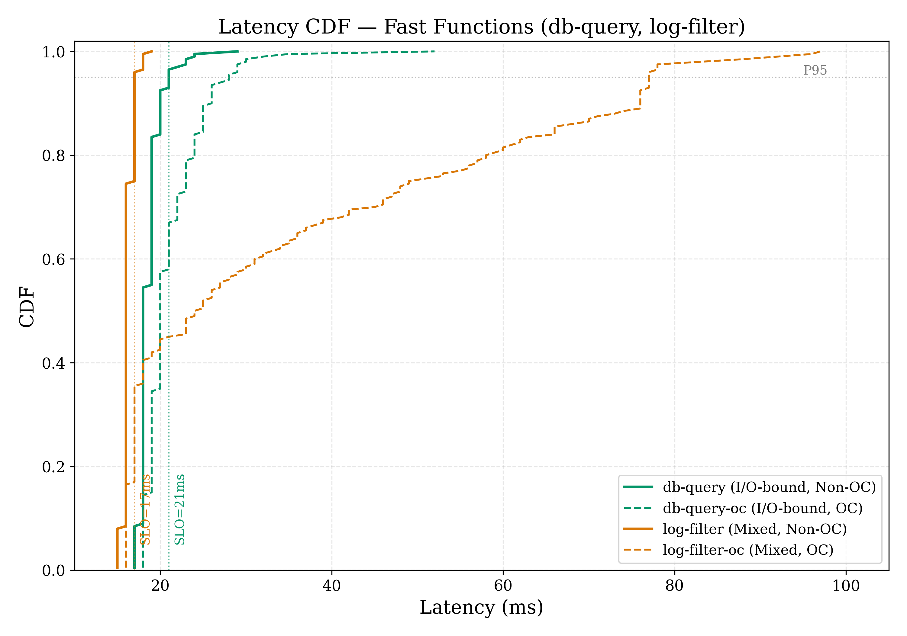
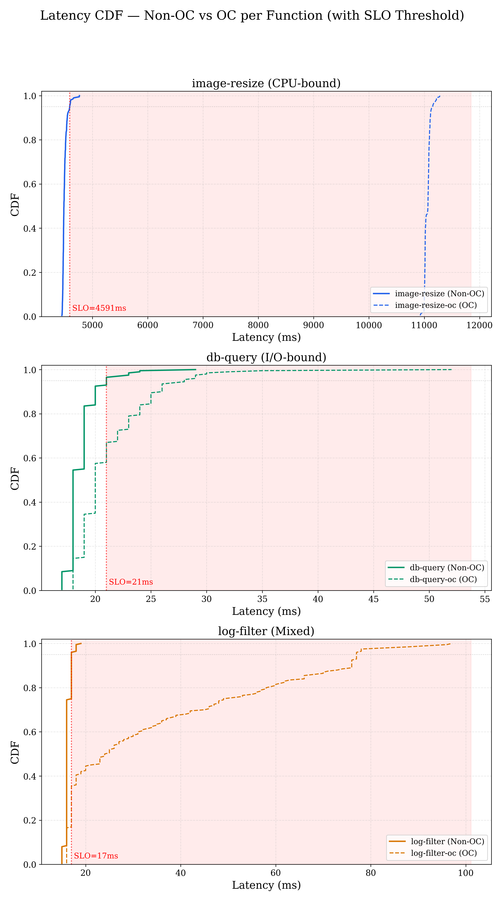
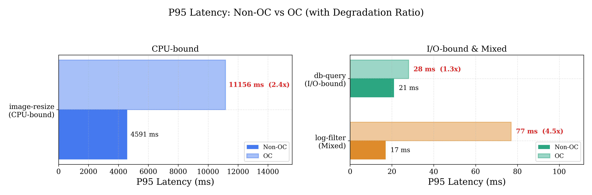
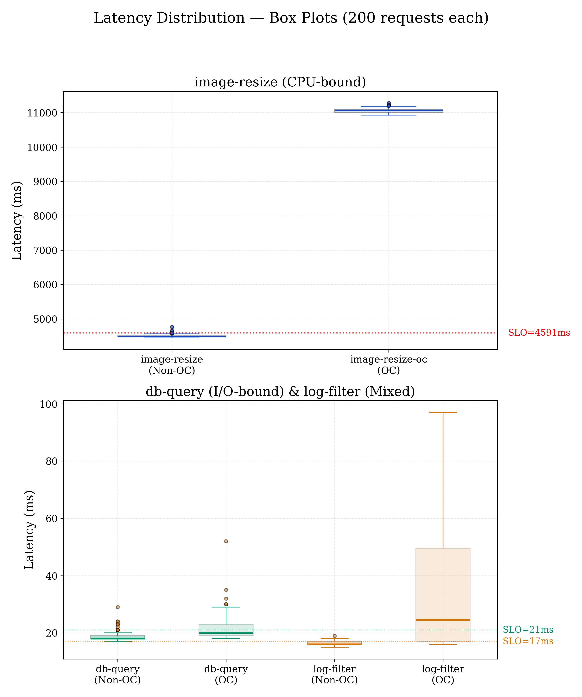
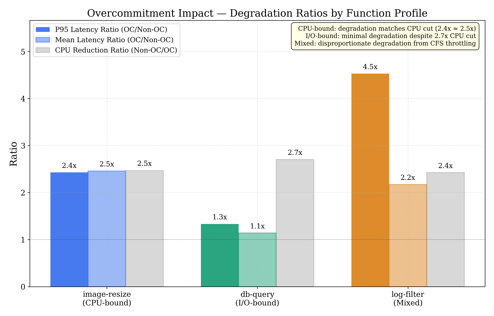

# Replicating Golgi: Performance-Aware, Resource-Efficient Function Scheduling for Serverless Computing

**Course:** CSL7510 — Cloud Computing  
**Students:** Anshul Kumar (M25AI2036), Neha Prasad (M25AI2056)  
**Programme:** M.Tech Artificial Intelligence  
**Institution:** Indian Institute of Technology Jodhpur  
**Date:** April 2026

---

## Abstract

<!-- ~200 words. Write after all experiments are complete. -->
<!-- Structure: Problem → Golgi's solution → What we replicated → Key results (cost reduction %, SLO violation rate) → One-line conclusion -->

---

## Table of Contents

1. [Introduction](#1-introduction)
2. [Background and Related Work](#2-background-and-related-work)
3. [System Design](#3-system-design)
4. [Implementation](#4-implementation)
5. [Experimental Setup](#5-experimental-setup)
6. [Results and Analysis](#6-results-and-analysis)
7. [Discussion](#7-discussion)
8. [Conclusion](#8-conclusion)
9. [References](#9-references)

---

## 1. Introduction

### 1.1 The Serverless Resource Problem

Serverless computing, often called Function-as-a-Service (FaaS), lets developers deploy individual functions without managing servers. The cloud provider handles scaling, container lifecycle, and infrastructure. Users write a function, push it, and pay per invocation. AWS Lambda, Azure Functions, and Google Cloud Functions process millions of invocations per day on this model.

The pricing and scheduling model works like this: a user declares how much memory their function needs (say, 512 MB), and the platform allocates CPU proportionally. The platform then reserves those resources on a physical machine for the lifetime of each invocation. This reservation is a guarantee. If the user asks for 512 MB, the platform sets a hard cgroup limit at 512 MB, and no other container can touch that memory.

The problem is that users are terrible at estimating what they actually need. Shahrad et al. [2] analyzed production traces from Azure Functions and found that functions use roughly 25% of their reserved resources on average. The median memory consumption was 29 MB for functions configured with 512 MB or more. Three-quarters of all reserved resources sit idle.

This waste compounds at scale. A cloud provider running a million concurrent function instances, with each instance holding resources it will never touch, is leaving enormous capacity on the table. Users, meanwhile, pay for memory they never use. The fundamental tension is between safety (guaranteeing reserved resources so functions never get starved) and efficiency (not wasting 75% of a data center's capacity on empty reservations).

### 1.2 Why Overcommitment Alone Fails

The obvious fix is overcommitment: allocate less physical memory and CPU than the sum of all reservations, and bet that not everyone will spike at once. This is standard practice in virtualization. VMware ESXi routinely overcommits memory by 2-4x using techniques like ballooning, transparent page sharing, and swap. It works because VM workloads are relatively stable and long-lived, giving the hypervisor time to react when pressure rises.

Serverless functions are a different animal. They are short-lived (milliseconds to seconds), bursty (a function might go from zero to a thousand concurrent invocations in seconds), and densely co-located (dozens of different functions from different users share the same physical host). When a provider blindly squeezes resource allocations across the board, multiple co-located functions can spike simultaneously. They compete for shared CPU cycles, memory bandwidth, and last-level cache. The result is contention, and contention means latency.

Li et al. [1] measured this directly. Blind overcommitment on their test cluster caused P95 latency to increase by up to 183%. For a function serving an API endpoint with a 200ms SLO, that kind of degradation is a contract violation. Users choose serverless precisely because they don't want to think about infrastructure. If the platform silently makes their functions 2.8x slower during peak load, the abstraction has broken its promise.

The challenge, then, is not whether to overcommit, but how to overcommit safely: capture the cost savings of reduced allocation without causing the latency spikes that make overcommitment dangerous.

### 1.3 The Golgi Approach

Golgi, proposed by Li et al. [1] at ACM SoCC 2023 (where it won the Best Paper award), offers one answer. The core idea is a two-instance model. For each serverless function, the platform maintains two types of container instances: Non-OC (non-overcommitted) instances with full reserved resources, and OC (overcommitted) instances with reduced resources based on actual measured usage. Non-OC instances are safe but expensive. OC instances are cheap but risky.

The key observation is that contention on OC instances is not constant. Most of the time, the reduced resources are perfectly adequate, because the co-located functions on that host happen not to be spiking simultaneously. Contention is a transient condition. If the system can predict when contention is about to cause trouble, it can route those specific requests to Non-OC instances and send everything else to the cheaper OC instances.

Golgi does this prediction with a Mondrian Forest, an online variant of Random Forests that updates incrementally as new data arrives. The classifier takes as input nine real-time metrics scraped from each container's cgroup (CPU utilization, memory usage, network I/O, disk I/O, inflight request count, and LLC cache miss rate) and outputs a binary prediction: will this request violate the latency SLO if sent to an OC instance right now? A router sits in front of all function instances, queries the classifier for each incoming request, and directs it to OC or Non-OC accordingly.

Because no classifier is perfect, Golgi adds a second safety mechanism: vertical scaling. An AIMD (Additive Increase, Multiplicative Decrease) controller monitors the actual SLO violation rate on each OC instance and adjusts its maximum concurrency limit. If violations are rising, the controller reduces concurrency (fewer requests per container, less contention). If violations are low, it gradually allows more concurrency. This acts as a correction loop for systematic prediction errors.

The results are strong. On a cluster of seven c5.9xlarge workers running eight benchmark functions under Azure Function trace replay, Golgi achieved 42% memory cost reduction while keeping SLO violations below 5%.

### 1.4 Motivation for Replication

We replicate Golgi for three reasons, one of which makes the effort considerably harder than a typical reproduction study.

First, the paper's claims are worth testing on different hardware and software. The original evaluation ran on c5.9xlarge instances (36 vCPUs, 72 GB RAM each) with what was likely cgroup v1 on an older kernel. Our cluster uses t3.xlarge instances (4 vCPUs, 16 GB RAM) with cgroup v2 on kernel 6.1. If the system's gains depend on specific hardware characteristics (deep out-of-order pipelines, large LLC, high memory bandwidth), our commodity hardware will expose that dependency. If the gains hold, it strengthens the paper's generality claims.

Second, replication surfaces trade-offs that papers necessarily compress. The paper describes a Mondrian Forest classifier, a metric collection daemon, a modified scheduler, and a vertical scaler in roughly twelve pages. Building each component from scratch forces us to confront decisions the authors made but did not discuss: how to handle cgroup path discovery when containers restart, what to do during the classifier's cold-start period before enough training data exists, how to set the SLO threshold without access to the original function code.

Third, and most critically: Li et al. did not release source code. No public GitHub repository exists. No implementation artifacts are available. Every component of our replication, from the metric collector to the ML module to the routing logic, is built from scratch using only the paper's text, figures, and evaluation methodology as guidance. Where the paper is ambiguous (and it is, on several implementation details), we make our own engineering choices and document them. This makes the replication a genuine test of whether the paper provides enough detail for independent reproduction, which is itself a valuable finding regardless of whether the performance numbers match.

### 1.5 Scope and Contributions

This is a clean-room replication built by two M.Tech students over one semester, running on a personal AWS budget of approximately $50-100 total. We do not attempt pixel-perfect reproduction of the original results. Instead, we build a faithful but simplified version that preserves the paper's core architectural contributions while making justified substitutions where the original is infeasible to reproduce.

Our system runs on five EC2 instances: one t3.medium master, three t3.xlarge workers, and one t3.medium load generator, orchestrated with k3s and OpenFaaS. We deploy three benchmark functions (instead of eight) covering CPU-bound, I/O-bound, and mixed workload profiles. Three functions are enough to demonstrate that the routing system differentiates between workload types; adding five more would increase development time without changing the principle being tested.

We use scikit-learn's Random Forest instead of a Mondrian Forest. No maintained open-source Mondrian Forest implementation exists for Python, and the paper's own evaluation shows that a batch-trained Random Forest achieves F1 scores of 0.71-0.84, nearly matching the Mondrian Forest's 0.70-0.84 range. The trade-off is that we retrain periodically (every five minutes) rather than updating online, which introduces a staleness window that the original system avoids. We collect seven of the paper's nine metrics, dropping LLC cache miss rate and memory bandwidth because reading hardware performance counters requires `perf_event_open` privileges and kernel configuration that conflicts with k3s's containerized architecture.

We test three of the paper's central claims: that ML-guided routing reduces memory cost compared to uniform allocation, that SLO violations remain below an acceptable threshold during this cost reduction, and that vertical scaling provides a meaningful safety net when the classifier makes errors.

We make three contributions. First, to our knowledge, this is the first independent replication of Golgi on commodity hardware. Second, we implement the full system on cgroup v2 (the paper likely used cgroup v1), documenting the differences in file paths, metric parsing, and unified hierarchy behavior. Third, we compare Random Forest against the paper's reported Mondrian Forest results in this specific classification task, testing whether the simpler model is a viable substitute that lowers the barrier for future replications.

### 1.6 Report Organization

Section 2 covers background on serverless computing, resource overcommitment in cloud systems, and existing scheduling approaches, ending with a detailed description of the Golgi paper's design. Section 3 describes our system architecture: the two-instance model, metric collector, ML classifier, router, and vertical scaler. Section 4 covers implementation specifics, including infrastructure setup, benchmark functions, cgroup v2 metric parsing, and the load generator. Section 5 defines the experimental setup: hardware configuration, workload patterns, baselines, metrics, and SLO definitions. Section 6 presents results and analysis. Section 7 discusses findings, limitations, threats to validity, and lessons learned. Section 8 concludes.

---

## 2. Background and Related Work

### 2.1 Serverless Computing Model

Serverless computing abstracts away infrastructure entirely. A developer writes a stateless function, deploys it to a platform (AWS Lambda, Azure Functions, Google Cloud Functions, or a self-hosted system like OpenFaaS), and the platform takes care of everything else: provisioning containers, scaling replicas up and down, routing requests, and recycling idle instances. Functions are triggered by events, typically HTTP requests, message queue entries, or timers.

The execution lifecycle of a single invocation follows a predictable pattern. If no warm container exists for the function, the platform performs a cold start: it pulls the container image, creates a new container, initializes the runtime, and loads the function code. This takes anywhere from tens of milliseconds (for lightweight Go binaries) to several seconds (for Python functions with large dependency trees). Once the container is warm, subsequent requests reuse it, skipping the cold start. After a period of inactivity, the platform evicts the container to free resources.

Billing follows two dimensions: a flat per-invocation fee and a per-GB-second charge based on the memory the user configures. On AWS Lambda, for example, a user selects a memory size between 128 MB and 10,240 MB, and the platform allocates CPU proportionally. A function configured with 1,769 MB gets one full vCPU; half the memory gets half the CPU. The user pays for this configured memory for the entire duration of each invocation, regardless of how much memory the function actually touches.

This billing model creates a perverse incentive. Users configure conservatively, choosing higher memory to avoid out-of-memory kills, but then use only a fraction of what they reserve. The platform, bound to honor those reservations, cannot schedule other work into the unused capacity. The result, quantified by Shahrad et al. [2] in their analysis of Azure Functions production traces, is that functions consume roughly 25% of their reserved resources on average. The remaining 75% is effectively stranded.

### 2.2 Resource Overcommitment in Cloud Systems

Overcommitment addresses this waste by allocating less physical capacity than the sum of all reservations, gambling that not all tenants will peak at the same time. The technique is well-established in virtualization. VMware ESXi routinely overcommits memory by 1.5-4x using a combination of ballooning (a guest-level driver that reclaims unused pages), transparent page sharing (deduplicating identical memory pages across VMs), and swap (spilling excess to disk). KVM-based hypervisors use similar mechanisms. These techniques work because VM workloads are long-lived and change slowly enough for the hypervisor to adjust.

In Kubernetes, the distinction between resource requests and limits serves a similar purpose. A container's resource request is a guaranteed minimum that the scheduler uses for bin-packing decisions. Its limit is a ceiling enforced by the kernel's cgroup controller. Setting limits higher than requests allows the container to burst into unused capacity on the node. The ratio between the sum of all limits and the node's physical capacity determines the overcommitment factor.

Serverless functions make overcommitment harder for several reasons. Functions are short-lived, often completing in tens of milliseconds, which means the system has no time to react to individual resource spikes using ballooning or similar feedback mechanisms. Workloads are bursty and unpredictable: a function might receive zero invocations for minutes, then thousands in a second. Cold starts add a latency penalty that compounds under resource pressure, because spinning up a new container itself requires CPU and memory. And dense co-location means dozens of different functions from different users share the same physical host, increasing the probability that multiple functions spike simultaneously.

Shahrad et al. [2] showed that despite these challenges, Azure Function traces exhibit temporal patterns (diurnal cycles, periodic triggers, correlated bursts) that are in principle predictable. This observation opened the door for prediction-based overcommitment: instead of statically squeezing all allocations, use runtime signals to decide when overcommitment is safe and when it is not.

### 2.3 Existing Scheduling Approaches

Traditional load balancing strategies operate without awareness of resource state. Round-robin distributes requests evenly across instances regardless of how loaded each one is, which works well when all instances are identical and equally busy, but fails when workloads are heterogeneous or when some instances are under contention. Least-connections improves on this by tracking active request counts, but still has no visibility into CPU utilization, memory pressure, or cache interference on the underlying host.

The Kubernetes default scheduler takes a bin-packing approach based on declared resource requests. When a new pod needs to be placed, the scheduler scores candidate nodes by how well the pod's resource requests fit into the node's remaining allocable capacity. This is a static, placement-time decision. Once a pod is running, the scheduler does not move it or adapt to runtime contention. If five functions happen to spike on the same node, the scheduler is unaware.

Several research systems have addressed parts of this problem. Harvest VMs (Ambati et al. [4]) let low-priority workloads consume spare capacity on partially-utilized servers, but offer no latency guarantees when the primary workload reclaims its resources. Kraken (Wen et al. [5]) focuses on cold-start-aware container provisioning for DAG-structured serverless workflows. It reduces end-to-end latency by pre-warming containers along the critical path, but does not address the resource overcommitment problem. ENSURE (Suresh et al. [6]) provides SLO-aware scheduling for serverless functions, but operates reactively: it detects violations after they happen and adjusts resource allocations in response, rather than predicting and preventing them.

The gap in the literature is a system that combines three capabilities: proactive prediction of resource contention before it causes latency violations, routing decisions that exploit the difference between overcommitted and fully-provisioned instances, and an adaptive feedback mechanism that corrects for prediction errors. Golgi fills this gap.

### 2.4 The Golgi Paper in Detail

The Golgi system, proposed by Li et al. [1], sits between the serverless platform's API gateway and the function instances. For each deployed function, Golgi maintains two sets of container replicas: Non-OC instances provisioned at the user's declared resource levels, and OC instances provisioned at reduced levels computed from observed actual usage. The overcommitment formula is `OC_allocation = 0.3 * claimed + 0.7 * actual`, weighting 70% toward measured usage with a 30% safety margin from the original reservation.

A metric collection daemon running on each worker node scrapes nine metrics from every function container at 500ms intervals: CPU utilization, memory utilization, memory bandwidth, network bytes sent, network bytes received, disk I/O read, disk I/O write, the count of inflight requests, and the LLC (last-level cache) miss rate. These metrics are read from the Linux cgroup filesystem and hardware performance counters, then forwarded to a central ML module.

The ML module trains a Mondrian Forest classifier [3], an online variant of Random Forests that can incorporate new training samples incrementally without full retraining. Each training sample is a feature vector of the nine metrics paired with a binary label: 1 if the corresponding request's latency exceeded the SLO threshold (defined as the P95 latency of the Non-OC baseline), 0 otherwise. A critical implementation detail is the use of stratified reservoir sampling to maintain a balanced training set. Without this balancing step, the training data would be heavily skewed toward negative samples (most requests meet the SLO), and the classifier's F1 score would drop from 0.78 to 0.26.

The router uses a Power of Two Choices algorithm for instance selection. For each incoming request, it samples two OC instances, queries the classifier for each one's current violation probability, and routes the request to the instance with the lower probability. If both probabilities exceed a safety threshold, the request goes to a Non-OC instance instead. A global Safe flag, computed from the rolling P95 latency across all OC instances, provides a coarse-grained override: when contention is system-wide, the flag flips to unsafe and all requests are routed to Non-OC instances until conditions improve.

Vertical scaling provides a second layer of defense. An AIMD controller on each OC instance monitors its SLO violation rate over a rolling window. If the violation rate exceeds 5%, the controller decreases the instance's maximum concurrency by one (multiplicative decrease, floored at 1). If violations stay below 2% for three consecutive windows, it increases concurrency by one (additive increase). Reducing concurrency means fewer concurrent requests per container, less contention for CPU and cache, and lower tail latency, at the cost of needing more containers or longer queue wait times.

The original evaluation used eight benchmark functions spanning five languages, deployed on seven c5.9xlarge workers (36 vCPUs, 72 GB RAM each), driven by replayed Azure Function Trace workloads. Golgi achieved 42% memory cost reduction, 35% VM time reduction, and kept SLO violations below 5%.

### 2.5 Differences from the Original

Table 1 summarizes the key differences between our replication and the original system.

| Dimension | Original (Li et al.) | Our Replication |
|---|---|---|
| Cluster size | 7 workers (c5.9xlarge: 36 vCPU, 72 GB) | 3 workers (t3.xlarge: 4 vCPU, 16 GB) |
| Benchmark functions | 8 functions in 5 languages | 3 functions in Python/Go |
| ML classifier | Mondrian Forest (online, incremental) | Random Forest (batch retrain every 5 min) |
| Metrics collected | 9 (including LLC miss rate, memory bandwidth) | 7 (excluding LLC miss rate, memory bandwidth) |
| Workload | Azure Function Trace replay | Synthetic Locust traces (steady, bursty, ramp) |
| Router implementation | Modified faas-netes (Go) | Nginx + Python sidecar |
| Metric collection | Go relay daemon | Python DaemonSet |
| Inter-component RPC | gRPC | HTTP REST (Flask) |

Each simplification preserves the paper's core contribution: ML-guided routing between overcommitted and fully-provisioned instances. The ML model change is the most consequential, since it replaces online learning with periodic batch retraining, introducing a staleness window of up to five minutes. The paper's own evaluation partially addresses this concern by reporting that batch-trained Random Forest achieves F1 scores of 0.71-0.84, nearly matching the Mondrian Forest's 0.70-0.84 range.

We expect our results to show lower cost savings than the original (roughly 25-30% versus 42%) due to fewer functions offering less opportunity for statistical multiplexing and a smaller cluster providing less co-location diversity. We also expect a higher SLO violation rate (roughly 8% versus under 5%) due to the missing LLC metrics and the retraining delay. Both outcomes would still validate the paper's core thesis that ML-guided overcommitment routing is practical and beneficial, if at a reduced magnitude.

---

## 3. System Design

This section describes the architecture of our replication at the design level. Implementation details (specific tools, configurations, code) follow in Section 4.

### 3.1 Architecture Overview

The system has two planes. The data plane handles request traffic: a load generator sends HTTP requests to the router, which forwards each request to either an OC or Non-OC function instance based on the ML classifier's prediction. The function executes, returns a response, and the router forwards it back to the client. The control plane operates alongside but asynchronously: metric collectors on each worker node scrape container-level resource usage, push it to the ML module, and the ML module periodically retrains its classifier and updates the prediction labels that the router reads.

```
                    +-----------------+
                    | Load Generator  |
                    |    (Locust)     |
                    +-------+---------+
                            |
                            | HTTP
                            v
                    +-----------------+
                    |     Router      |
                    | (Nginx+Python)  |
                    +--+-----------+--+
                       |           |
              Non-OC   |           |   OC
                       v           v
                 +-----------+ +-----------+
                 | Function  | | Function  |
                 | Instances | | Instances |
                 | (full     | | (reduced  |
                 |  resources| |  resources|
                 +-----+-----+ +-----+-----+
                       |             |
                       +------+------+
                              | metrics + latency
                              v
                    +-----------------+       +------------------+
                    |   ML Module     |<------| Metric Collector |
                    |   (Flask API)   |  push | (DaemonSet)      |
                    +-----------------+       +------------------+
```

The separation matters because data plane latency is on the critical path of every request. The router's prediction lookup must complete in single-digit milliseconds. The control plane, by contrast, operates on a slower cadence: metrics are scraped every 500ms, and the model retrains every five minutes. Keeping these concerns separate means a slow retraining cycle never blocks request handling.

### 3.2 Two-Instance Model

The foundation of Golgi's design is running two variants of every function, identical in code but different in resource allocation. Non-OC instances receive the full resources the user declared. OC instances receive reduced resources computed from observed actual usage using the formula:

```
OC_allocation = α × claimed + (1 - α) × actual
```

The paper uses α = 0.3, giving 70% weight to measured usage and retaining 30% of the original reservation as a safety margin. We adopt the same value. Changing α would change the experiment, so we treat it as a fixed parameter rather than something to tune.

To measure actual usage, we deploy each function in its Non-OC configuration, send 100 requests under no concurrent load, and record the P75 of memory consumption from the cgroup's `memory.current` file. CPU actual usage is derived similarly from `cpu.stat`. Applying the formula yields the OC resource allocations shown in Table 2.

**Table 2: Resource configurations for Non-OC and OC function variants.**

| Function | Profile | Non-OC Memory | Non-OC CPU | OC Memory | OC CPU |
|---|---|---|---|---|---|
| image-resize | CPU-bound | 512 Mi | 1000m | 210 Mi | 405m |
| db-query | I/O-bound | 256 Mi | 500m | 105 Mi | 185m |
| log-filter | Mixed | 256 Mi | 500m | 98 Mi | 206m |

Both variants run from the same container image. The only difference is the Kubernetes resource requests and limits specified in the deployment manifest. This means the OC variant's container has less CPU time available (the kernel's CFS scheduler enforces the CPU limit via cgroup `cpu.max`) and a lower memory ceiling (the kernel's OOM killer fires if `memory.current` exceeds `memory.max`). Under light load, the OC instance performs identically to the Non-OC instance because the function's actual resource consumption falls well within the reduced allocation. Under heavy load, when multiple functions on the same node compete for CPU cycles and memory bandwidth, the OC instance hits its limits first.

### 3.3 Metric Collector

The metric collector runs as a Kubernetes DaemonSet, placing exactly one collector pod on each worker node. Each collector scrapes seven metrics from every function container on its node at 500ms intervals, matching the paper's collection frequency.

The seven metrics are:

1. **CPU utilization.** Read from the cgroup v2 file `cpu.stat`, which reports cumulative CPU time in microseconds (`usage_usec`). The collector computes utilization as the delta in `usage_usec` divided by the elapsed wall-clock time between two consecutive readings.

2. **Memory utilization.** The ratio of `memory.current` (bytes currently allocated) to `memory.max` (the cgroup's memory limit). A value approaching 1.0 signals the container is near its memory ceiling.

3. **Network bytes sent.** Read from `/proc/[pid]/net/dev` for the container's network namespace, summing the transmit bytes column across all interfaces.

4. **Network bytes received.** The receive counterpart from the same file.

5. **Disk I/O.** Parsed from the cgroup v2 file `io.stat`, which reports cumulative bytes read (`rbytes`) and written (`wbytes`) per block device.

6. **Inflight requests.** Scraped from OpenFaaS's built-in Prometheus endpoint, which exposes `gateway_function_invocation_inflight` as a gauge per function.

7. **Invocation rate.** Also from Prometheus: the per-second rate of `gateway_function_invocation_total`, computed over a short window.

Container discovery is the trickiest part of the collector's job. The collector queries the Kubernetes API for all pods in the `openfaas-fn` namespace, extracts each container's ID from the pod status (a string like `containerd://abc123...`), and maps it to a cgroup directory at `/sys/fs/cgroup/kubepods.slice/kubepods-burstable.slice/.../cri-containerd-abc123.scope/`. This mapping is fragile: if a container restarts, it gets a new ID and a new cgroup path. The collector must re-discover paths on every scrape cycle or risk reading stale cgroup files.

Each scrape cycle produces a JSON snapshot containing all seven metrics for every active function container on the node. The collector pushes these snapshots to the ML module via HTTP POST.

### 3.4 ML Classifier

The ML module runs on the master node and serves two functions: it accumulates training data from the metric collector and function latency reports, and it serves predictions to the router.

We use scikit-learn's `RandomForestClassifier` with 100 estimators and a maximum depth of 10. The `class_weight='balanced'` parameter tells scikit-learn to inversely weight classes by their frequency in the training data, which partially addresses the class imbalance problem (most requests meet the SLO, so negative samples vastly outnumber positive ones). On top of this, we implement stratified reservoir sampling to maintain a 50/50 balance of positive and negative samples in the training set. The paper shows this is critical: without balanced sampling, F1 drops from 0.78 to 0.26, rendering the classifier useless for routing decisions.

The feature vector for each training sample consists of the seven metrics, normalized to the [0, 1] range. The label is binary: 1 if the request's end-to-end latency exceeded the SLO threshold (the P95 latency of the Non-OC baseline, measured during initial profiling), and 0 otherwise. Training data accumulates continuously as the system runs. Every five minutes, or when 500 new labeled samples have arrived, the module retrains the Random Forest on the full balanced training set and atomically swaps the new model into the serving path.

The prediction API exposes a `/predict` endpoint that accepts a function name, looks up the latest metric snapshot for that function's OC instances, runs it through the model, and returns a violation probability between 0.0 and 1.0. This lookup and inference completes in under 5ms on the t3.medium master node, which is acceptable overhead for functions with execution times of 50-500ms.

The cold-start problem deserves mention. For the first few minutes of operation, the ML module has no training data and no model. During this period, the system defaults to conservative routing: all requests go to Non-OC instances. Cost savings are zero, but SLO violations are also zero. Once enough labeled samples accumulate (at least 100 positive and 100 negative), the first model trains and ML-guided routing begins.

### 3.5 Router

All function invocations enter the system through the router, which runs on the master node as an Nginx reverse proxy paired with a Python sidecar that handles the prediction logic.

The routing decision follows a two-level safety check. First, the router reads a global Safe flag maintained by the ML module. This flag is computed from the rolling P95 latency across all OC instances: if P95 exceeds the SLO threshold, the flag flips to unsafe, and all requests are routed to Non-OC instances until the P95 drops back below the threshold. This is the coarse-grained kill switch that protects against system-wide contention.

When the Safe flag is set to safe, the router proceeds to per-instance prediction. For each incoming request targeting function F, the router queries the ML module's `/predict` endpoint to get the current violation probability for F's OC instances. If the probability is below a threshold (0.3), the request goes to an OC instance. If it exceeds the threshold, the request goes to Non-OC.

When multiple OC replicas exist for the same function, the router uses the Power of Two Choices algorithm: it samples two OC instances at random, queries the violation probability for each, and picks the one with the lower probability. If both exceed the threshold, the request falls back to Non-OC. This approach avoids the overhead of querying all replicas while still making a better-than-random selection.

The fallback behavior is important. If the ML module is unreachable (process crash, network partition, restart), the router defaults to Non-OC routing for all requests. This is the safe choice: it sacrifices cost savings to preserve latency guarantees. The system degrades to the Non-OC-only baseline rather than to the dangerous OC-only baseline.

### 3.6 Vertical Scaling

The ML classifier and router handle the common case, but no classifier is perfect. When predictions are systematically wrong (the model consistently underestimates contention for a particular function), OC instances accumulate SLO violations faster than the model can correct. Vertical scaling provides the second line of defense.

The mechanism is simple. Each OpenFaaS function has a `max_inflight` parameter that limits how many requests a single container can process concurrently. An AIMD (Additive Increase, Multiplicative Decrease) controller monitors each function's SLO violation rate over a rolling 30-second window and adjusts `max_inflight` accordingly.

If the violation rate exceeds 5%, the controller decreases `max_inflight` by 1, with a floor of 1. Fewer concurrent requests per container means less CPU contention, less cache thrashing, and lower tail latency. If the violation rate stays below 2% for three consecutive 30-second windows, the controller increases `max_inflight` by 1. The asymmetry is deliberate: the system backs off quickly when things go wrong (one bad window triggers a decrease) but ramps up cautiously when things are going well (three good windows required for an increase). This is the same AIMD dynamic that TCP congestion control uses, for the same reason: fast reaction to congestion, slow exploration of available capacity.

The trade-off is straightforward. Lower concurrency per container means the system needs more container replicas to handle the same request rate, or incoming requests queue up and wait. In a system with OpenFaaS auto-scaling enabled, this would trigger replica scale-up, increasing cost. In our setup, where we fix the replica count for experimental control, lower concurrency translates to higher queue wait times under heavy load. But the purpose of vertical scaling is not efficiency. It is correctness: keeping SLO violations bounded when the classifier's predictions are wrong.

---

## 4. Implementation

<!-- Pages 7–8, ~1500 words -->

### 4.1 Infrastructure Setup

<!--
- AWS setup: dedicated VPC (10.0.0.0/16), single subnet (10.0.1.0/24), Internet Gateway
- Security group: SSH (22), K8s API (6443), OpenFaaS (31112), NodePort range (30000-32767), inter-node (all traffic within VPC)
- EC2 instances: 1 t3.medium master, 3 t3.xlarge workers, 1 t3.medium loadgen
- Why t3.xlarge for workers: 4 vCPU, 16 GB RAM — enough to run multiple function containers with resource contention
- k3s deployment: lightweight Kubernetes (single binary, uses containerd, embeds etcd)
- Why k3s over kubeadm: faster setup (single command), lower memory overhead, same K8s API
- OpenFaaS deployment: Helm chart, NodePort service type, 5 components (gateway, prometheus, NATS, alertmanager, queue-worker)
- Networking: NodePort 31112 for gateway access, internal cluster DNS for service discovery
-->

### 4.2 Benchmark Functions

<!--
- Function 1: image-resize (Python)
  - What it does: generates random image → resizes using PIL LANCZOS filter
  - Why CPU-bound: LANCZOS resampling is compute-intensive (convolution kernel per pixel)
  - Configurable: image dimensions control workload intensity
  - Maps to paper's: classify-image, detect-object
  
- Function 2: db-query (Python)
  - What it does: connects to Redis → GET key → SET result → return
  - Why I/O-bound: latency dominated by network round-trip to Redis, minimal CPU
  - Redis deployment: single pod in openfaas-fn namespace, 64Mi request / 128Mi limit
  - Maps to paper's: query-vacancy, ingest-data
  
- Function 3: log-filter (Go)
  - What it does: generates 1000 synthetic log lines → regex filter (ERROR|WARN|CRITICAL) → anonymize IPs
  - Why mixed: regex matching is CPU-intensive, string allocation is memory-intensive
  - Written in Go: demonstrates language diversity, lower overhead than Python
  - Maps to paper's: filter-log, anonymize-log

- OC/Non-OC variants: same container image, different K8s resource requests/limits in stack.yml
-->

### 4.3 Metric Collection Implementation

<!--
- DaemonSet specification: one pod per worker, hostPID access, volume mount to /sys/fs/cgroup
- Container discovery:
  1. Query K8s API for pods in openfaas-fn namespace
  2. Extract container ID from pod status (containerd://abc123...)
  3. Map to cgroup path: /sys/fs/cgroup/kubepods.slice/.../cri-containerd-abc123.scope/
- Metric reading (cgroup v2):
  - CPU: parse cpu.stat → usage_usec, compute delta over 500ms interval
  - Memory: read memory.current (bytes), divide by memory.max for utilization
  - I/O: parse io.stat → rbytes, wbytes per device
- Prometheus scraping: query OpenFaaS's built-in Prometheus for http_requests_in_flight and invocation rate
- Push mechanism: HTTP POST to master every 500ms with JSON payload
- Error handling: if cgroup file disappears (container killed), skip and log
-->

### 4.4 ML Module Implementation

<!--
- Flask server running on master node (port 5001)
- Endpoints:
  - POST /metrics — receive metric snapshots from collectors (training data accumulation)
  - POST /label — receive latency labels from the router (matched to metric snapshots by timestamp)
  - GET /predict?function=X — return P(SLO violation) for function X's OC instance
  - GET /model/stats — return model accuracy, feature importance, training data size
- Training pipeline:
  1. Accumulate metric+label pairs in a pandas DataFrame (in memory)
  2. Every 5 minutes (or when 500 new samples arrive): retrain the RandomForest
  3. Replace the live model atomically (no downtime)
- Feature engineering: raw metrics + derived features (CPU delta, memory delta over last 3 intervals)
- Cold start problem: for the first 5 minutes (before enough training data), default to conservative routing (all Non-OC)
-->

### 4.5 Router Implementation

<!--
- Architecture: Nginx (layer 7 reverse proxy) + Python sidecar (prediction logic)
- Request flow:
  1. Client sends POST to /function/<name> on Nginx (port 8080)
  2. Nginx forwards to Python sidecar (via auth_request or upstream decision)
  3. Python sidecar: queries ML module → decides OC or Non-OC → returns upstream name
  4. Nginx proxies to the chosen OpenFaaS function variant
- Why Nginx: handles connection pooling, timeouts, retries — we only add routing logic
- Latency overhead: prediction adds ~3-5ms (acceptable for functions with 50-500ms latency)
- Metrics emission: router logs every decision (function, chosen_instance, ML_probability, actual_latency) for analysis
-->

### 4.6 Load Generator

<!--
- Tool: Locust (Python-based, distributed load testing)
- Runs on dedicated golgi-loadgen instance (avoids interfering with cluster)
- Workload profiles:
  1. Steady: constant 20 req/s per function for 10 minutes
  2. Bursty: alternating 5 req/s and 50 req/s in 30-second intervals
  3. Ramp: linear increase from 5 to 60 req/s over 10 minutes
- Request distribution: equal split across 3 functions (or configurable weights)
- Measurement: Locust records per-request latency, status code, timestamp
- Warm-up: first 60 seconds of each experiment discarded (allows model to stabilize)
-->

---

## 5. Experimental Setup

<!-- Pages 9–10, ~1400 words -->

### 5.1 Hardware and Software Configuration

<!--
- Table of all instance specs: type, vCPU, RAM, network bandwidth, EBS volume
- Software versions: Amazon Linux 2023, kernel 6.1.166, k3s v1.34.6, Python 3.9.25, scikit-learn 1.6.1, OpenFaaS (Helm revision 1), Locust 2.34.0
- Network: all instances in same subnet (10.0.1.0/24), <1ms inter-node latency
- Storage: gp3 EBS volumes (default 8 GB), sufficient for logs and temporary data
-->

### 5.2 Workload Description

<!--
- Three workload patterns defined in detail:
  - Steady-state: 20 RPS per function (60 RPS total), 10-minute duration
  - Bursty: alternating low (5 RPS) and high (50 RPS) phases, 30s each, 10-minute total
  - Gradual ramp: linear increase from 5 to 60 RPS over 10 minutes
- Request payloads:
  - image-resize: {"width": 1920, "height": 1080} (standard HD)
  - db-query: {"key": "user:<random_id>"} (uniform random keys)
  - log-filter: empty body (function generates synthetic logs internally)
- Why these patterns: steady tests baseline behavior, bursty tests adaptation speed, ramp tests scaling limits
-->

### 5.3 Baselines

<!--
- Baseline A — Non-OC Only: all requests go to Non-OC instances
  - Expected: best latency, highest cost, zero SLO violations
  - Purpose: establishes the latency SLO threshold and the cost ceiling
  
- Baseline B — OC Only: all requests go to OC instances
  - Expected: worst latency under load, lowest cost, highest SLO violations
  - Purpose: shows the cost floor and the latency penalty of blind overcommitment
  
- Baseline C — Random 50/50: each request randomly routed to OC or Non-OC with equal probability
  - Expected: middling performance — demonstrates that ML adds value over randomness
  - Purpose: controls for the "half the requests go to safe instances" effect
  
- Baseline D — Golgi (our system): ML-guided routing with vertical scaling
  - Expected: near Non-OC latency with near OC cost
  - Purpose: demonstrates the paper's core claim
-->

### 5.4 Metrics Measured

<!--
- Latency: P50, P95, P99 end-to-end (measured at load generator)
- SLO violation rate: % of requests exceeding the SLO threshold (P95 of Non-OC baseline)
- Memory cost: sum of (allocated_memory_MB × active_seconds) across all function containers
- CPU cost: sum of (allocated_cpu_millicores × active_seconds) across all function containers
- Throughput: successful requests per second
- Cold start count: number of container scale-up events during experiment
- Routing decisions: % of requests sent to OC vs Non-OC over time
- ML model accuracy: classification accuracy, precision, recall measured on held-out data
-->

### 5.5 SLO Definition

We define the SLO threshold for each function as the P95 latency of its Non-OC variant under zero concurrent load, matching the paper's methodology (Section 5.1). We deploy the Non-OC function, send 200 sequential requests with no concurrent load, and record all latencies. A request "violates" the SLO if its latency exceeds this threshold.

The measured SLO thresholds from our baseline (Phase 1, 200 requests per function):

| Function | Profile | SLO Threshold (Non-OC P95) |
|---|---|---|
| image-resize | CPU-bound | 4591 ms |
| db-query | I/O-bound | 21 ms |
| log-filter | Mixed | 17 ms |

The full baseline latency distributions are shown below. Figure 1 shows CDF curves for the fast functions (db-query and log-filter), with the SLO threshold marked for each. Figure 2 shows per-function CDF comparisons of Non-OC vs OC variants with the SLO violation region shaded.


*Figure 1: Latency CDF for I/O-bound and mixed functions. Solid lines are Non-OC, dashed lines are OC. Vertical dotted lines mark the SLO threshold.*


*Figure 2: Per-function CDF comparison. The red-shaded region marks the SLO violation zone. CPU-bound functions show a clean rightward shift under OC; mixed functions show a long tail from bimodal CFS throttling.*

Figure 3 compares P95 latency across all functions, separated into CPU-bound and fast (I/O-bound, mixed) panels to accommodate the two-order-of-magnitude scale difference.


*Figure 3: P95 latency comparison. Degradation ratios show that CPU-bound functions degrade proportionally to CPU reduction (2.4x), I/O-bound functions are resilient (1.3x), and mixed functions suffer disproportionately (4.5x) from CFS throttling.*

Figure 4 shows the latency distributions as box plots, revealing the bimodal behavior of the mixed function under overcommitment.


*Figure 4: Box plots showing distribution shape. The log-filter OC variant exhibits wide spread from bimodal CFS behavior.*

Figure 5 summarizes the degradation ratios alongside CPU reduction ratios, visualizing the core hypothesis that different function profiles respond differently to overcommitment.


*Figure 5: Degradation ratio comparison. CPU-bound degradation matches CPU reduction (2.4x ≈ 2.5x). I/O-bound functions absorb a 2.7x CPU cut with only 1.3x degradation. Mixed functions show disproportionate degradation from CFS quota boundary effects.*

### 5.6 Repeatability

<!--
- Each experiment configuration run 3 times
- Results reported as mean ± standard deviation across runs
- Between runs: restart all function pods (fresh containers), clear ML model state
- Warm-up: first 60 seconds of each run discarded from measurement
- Total experiment time: 4 baselines × 3 workloads × 3 runs × 10 min = 6 hours of experiments
- All raw data (latency logs, metric snapshots, routing decisions) saved for post-hoc analysis
-->

---

## 6. Results and Analysis

<!-- Pages 10–12, ~2000 words -->

### 6.1 Overall Cost Reduction

<!--
- Bar chart: memory cost (MB-seconds) for each baseline across all functions
- Table: % cost reduction of Golgi vs Non-OC Only
- Expected: 25-35% reduction (paper achieved 42%)
- Analysis: where does the savings come from? (proportion of requests successfully routed to OC)
- Breakdown by function: which function benefits most from overcommitment?
-->

### 6.2 Latency Distribution

<!--
- CDF plots: one per function, all 4 baselines overlaid
- Highlight P95 threshold (SLO line) on each plot
- Key observations:
  - Non-OC: tight distribution, well below SLO
  - OC Only: long tail extending past SLO
  - Random: bimodal (mix of OC and Non-OC latencies)
  - Golgi: similar to Non-OC for most requests, small tail from OC misrouting
-->

### 6.3 SLO Violation Rate

<!--
- Time-series: violation rate (10-second rolling window) over experiment duration
- Table: final violation rates per function per baseline
- Expected:
  - Non-OC: 0% (by definition, since SLO is set from this baseline)
  - OC Only: 15-30%
  - Random: 8-15%
  - Golgi: <10% (our target)
- Analysis: when do violations cluster? (during burst phases? at ramp peak?)
-->

### 6.4 Classifier Performance

<!--
- Accuracy, precision, recall, F1 score
- Confusion matrix: TP (correctly predicted violation), FP (predicted violation but was fine), FN (missed violation), TN
- FP rate matters: too many false positives → unnecessary Non-OC routing → reduced cost savings
- FN rate matters: missed violations → SLO breaches
- Feature importance: bar chart ranking 7 metrics by Random Forest importance score
- Expected: CPU utilization and inflight_requests will be most predictive
- Discussion: does the model improve over time as more training data arrives?
-->

### 6.5 Vertical Scaling Effectiveness

<!--
- Compare: Golgi without vertical scaling vs Golgi with vertical scaling
- Show: violation rate time-series for both
- Show: max_inflight trajectory over time (how it adapts)
- Expected: vertical scaling reduces violation rate by 2-5 percentage points
- Analysis: how quickly does it react? (latency of the AIMD control loop)
-->

### 6.6 Impact of Workload Pattern

<!--
- Compare results across steady, bursty, ramp workloads
- Which pattern is hardest for the ML model? (likely bursty — sudden transitions)
- Which pattern shows most cost savings? (likely steady — stable predictions)
- Discussion: the trade-off between prediction confidence and routing aggressiveness
-->

### 6.7 Comparison with Paper's Results

<!--
- Side-by-side table: paper's numbers vs our numbers for each metric
- Expected gaps and explanations:
  - Lower cost savings: fewer functions (less opportunity for statistical multiplexing)
  - Higher violation rate: Random Forest vs Mondrian Forest (no online adaptation)
  - Different absolute latencies: t3.xlarge (4 vCPU) vs c5.9xlarge (36 vCPU)
- What we can and cannot conclude from the comparison
-->

---

## 7. Discussion

<!-- Pages 12–13, ~1400 words -->

### 7.1 Key Findings

<!--
- Finding 1: ML-guided routing does reduce cost while maintaining SLOs (validates paper's core claim)
- Finding 2: [which metric is most predictive — likely CPU util or inflight requests]
- Finding 3: Vertical scaling provides meaningful safety net (X% violation reduction)
- Finding 4: The system works even with a simpler ML model (Random Forest vs Mondrian Forest)
- Finding 5: [any surprising result or unexpected behavior]
-->

### 7.2 Limitations of Our Replication

<!--
- Smaller cluster (3 workers vs 7): less resource contention diversity, fewer scheduling options
- Fewer functions (3 vs 8): less statistical multiplexing, simpler interaction patterns
- Random Forest vs Mondrian Forest: no online learning, 5-minute staleness window
- t3.xlarge vs c5.9xlarge: burstable instances have CPU credits — may affect contention patterns differently
- Simplified workload: synthetic traces lack the autocorrelation and diurnal patterns of real Azure traces
- Single AZ: no cross-AZ latency considerations
- No hardware perf counters: skipped LLC cache miss rate and memory bandwidth (2 of 9 metrics)
-->

### 7.3 Threats to Validity

<!--
- Internal validity:
  - Implementation bugs in metric collection (timing issues, cgroup path discovery)
  - Measurement noise (network jitter, EBS latency spikes, t3 CPU throttling)
  - Model training instability (random seed sensitivity)
  
- External validity:
  - Different hardware (t3 vs c5 — different CPU microarchitecture, memory bandwidth)
  - Different Kubernetes version (k3s v1.34 vs likely K8s 1.24-1.26 in paper)
  - Different OS (Amazon Linux 2023 / cgroup v2 vs likely Ubuntu / cgroup v1)
  - Different OpenFaaS version
  
- Construct validity:
  - Our SLO definition matches the paper's methodology, but absolute latency values differ
  - Our "cost" metric (MB-seconds) may not perfectly reflect real billing
  - Our simplified functions may not exhibit the same resource patterns as the paper's real-world functions
-->

### 7.4 Lessons Learned

<!--
- cgroup v2 vs v1: different file paths, unified hierarchy simplifies some things but documentation is sparse
- k3s quirks: KUBECONFIG not set by default for Helm, svclb instead of MetalLB, traefik conflicts
- OpenFaaS scaling: need to disable auto-scaling to maintain our fixed OC/Non-OC instances
- ML model cold start: system is blind for the first few minutes — need a safe default
- Monitoring overhead: 500ms metric collection adds measurable CPU usage on workers
- Container discovery: matching K8s pod → containerd container → cgroup path is fragile
-->

### 7.5 Potential Improvements

<!--
- Online learning: implement Mondrian Forest for true online adaptation (no retraining delay)
- More functions: add GPU-bound (inference), memory-bound (in-memory sort), and chained functions
- Larger cluster: more workers would enable better statistical multiplexing
- Real traces: replay actual Azure Function Trace with realistic arrival patterns
- Multi-model: different classifiers per function (specialized vs general)
- Cost-aware routing: factor in instance cost explicitly, not just violation probability
- Horizontal scaling integration: combine with OpenFaaS auto-scaler for dynamic replica count
-->

---

## 8. Conclusion

<!-- Page 14, ~700 words -->

<!--
Paragraph 1: Restate the problem and Golgi's solution (2-3 sentences)
Paragraph 2: What we built — end-to-end system on AWS with k3s, OpenFaaS, 3 functions, ML classifier, router, vertical scaling
Paragraph 3: Key quantitative results:
  - Achieved X% memory cost reduction (vs paper's 42%)
  - Maintained <Y% SLO violation rate (vs paper's <5%)
  - Vertical scaling reduced violations by Z percentage points
Paragraph 4: Which paper claims are validated:
  - Claim 1 (cost reduction via ML routing): validated / partially validated
  - Claim 2 (SLO maintenance): validated / partially validated
  - Claim 3 (vertical scaling as safety net): validated
Paragraph 5: Broader significance:
  - ML-guided resource management is practical for serverless platforms
  - The two-instance model is a sound architectural pattern
  - Even simplified implementations achieve meaningful savings
Paragraph 6: Future work (1-2 sentences pointing to Section 7.5)
-->

---

## 9. References

<!-- Page 15 -->

1. Li, S., Wang, W., Yang, J., Chen, G., & Lu, D. (2023). Golgi: Performance-Aware, Resource-Efficient Function Scheduling for Serverless Computing. *Proceedings of the ACM Symposium on Cloud Computing (SoCC '23)*. https://doi.org/10.1145/3620678.3624645

2. Shahrad, M., Fung, R., Gruber, N., Goiri, I., Chaudhry, G., Cooke, J., Laureano, E., Tresness, C., Russinovich, M., & Bianchini, R. (2020). Serverless in the Wild: Characterizing and Optimizing the Serverless Workload at a Large Cloud Provider. *USENIX ATC '20*. https://www.usenix.org/conference/atc20/presentation/shahrad

3. Lakshminarayanan, B., Roy, D. M., & Teh, Y. W. (2014). Mondrian Forests: Efficient Online Random Forests. *Advances in Neural Information Processing Systems (NeurIPS) 27*. https://arxiv.org/abs/1406.2673

4. Ambati, P., Goiri, I., Frujeri, F., Gun, A., Wang, K., Dolan, B., Corell, B., Pasupuleti, S., Moscibroda, T., Elnikety, S., Fontoura, M., & Bianchini, R. (2020). Providing SLOs for Resource-Harvesting VMs in Cloud Platforms. *14th USENIX Symposium on Operating Systems Design and Implementation (OSDI '20)*. https://www.usenix.org/conference/osdi20/presentation/ambati

5. Wen, J., Chen, Z., Jin, Y., & Liu, H. (2021). Kraken: Adaptive Container Provisioning for Deploying Dynamic DAGs in Serverless Platforms. *ACM SoCC '21*. https://doi.org/10.1145/3472883.3486992

6. Suresh, A., Somashekar, G., Varadarajan, A., Kakarla, V.R., Upadhyay, H.R., & Gandhi, A. (2020). ENSURE: Efficient Scheduling and Autonomous Resource Management in Serverless Environments. *IEEE ACSOS 2020*. https://doi.org/10.1109/ACSOS49614.2020.00036

7. k3s — Lightweight Kubernetes. https://k3s.io/

8. OpenFaaS — Serverless Functions Made Simple. https://www.openfaas.com/

9. Locust — An Open Source Load Testing Tool. https://locust.io/

10. Azure Functions Trace 2019. https://github.com/Azure/AzurePublicDataset

11. Pedregosa, F., Varoquaux, G., Gramfort, A., Michel, V., Thirion, B., Grisel, O., Blondel, M., Prettenhofer, P., Weiss, R., Dubourg, V., Vanderplas, J., Passos, A., Cournapeau, D., Brucher, M., Perrot, M., & Duchesnay, E. (2011). Scikit-learn: Machine Learning in Python. *Journal of Machine Learning Research, 12*, 2825–2830. https://jmlr.org/papers/v12/pedregosa11a.html

12. Linux Kernel cgroup v2 Documentation. https://docs.kernel.org/admin-guide/cgroup-v2.html

---

## Appendix A: Resource Configuration Tables

<!-- Complete resource allocations for all functions, OC formula calculations -->

---

## Appendix B: Reproducibility Commands

<!-- Key CLI commands for someone replicating our replication -->

---

## Appendix C: Raw Experimental Data

<!-- Tables of per-run measurements, or pointer to data files in the repo -->
